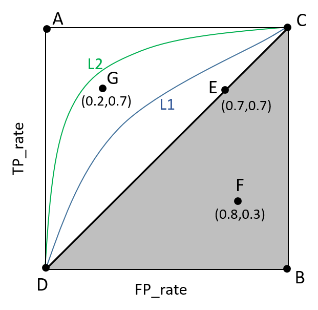

# 一、引言

基本情况：

1. 人工智能

   > 能够像人一样，**感知**外在的事务，并通过**自主的思维过程**做出有目的、有意义的**响应**。
   >
   > 总的来说，人工智能包含3个方面：
   >
   > - 感知
   > - 决策
   > - 行动

2. 模式识别

   > 是实现人工智能的一种**工具**，也就是要让机器知道它们处理的是什么。解决识别问题，侧重各层面的识别部分
   >
   > 狭义讲，模式识别是一种**任务**。

3. 机器学习

   > 是贯穿整个智能系统从**感知到决策到行动**的控制。
   >
   > 狭义讲，机器学习是一种通用工具，是目前模式识别使用最多的工具。

**人工智能**的发展经历了**两个阶段**

1. 逻辑推理，知识库与专家系统

   > 1980年，之前-逻辑推理，，人工建立规则、知识库

2. 机器学习

   > 1980年，之后-模仿人的学习能力，从案例中进行学习获得经验和知识

**机器学习**的发展经历了**三个阶段**：

1. 1980-1990年

   > 成为**独立**的学科，诞生了**决策树、反向传播算法、卷积神经网络**等经典算法

2. 1991-2011年

   > 蓬勃**发展**期，出现了大量方法，2次图灵奖。经典算法包括**支持向量机，随机森林，Boosting，RNN/LSTM流形学习，各种聚类**算法。

3. 2012年-至今

   > **深度学习**时代，**深度卷积神经网络，深度RNN，深度强化学习，深度生成模型，图神经网络，自动化机器学习**。

# 二、基础知识

## 2.1 机器学习定义

**定义一**

> 对于 **某类任务T** 和 **性能度量P**，一个计算机程序能从 **经验E** 中学习是指，
>
> 经过 **经验E** 的改进后，它在 **任务T** 上由 **性能度量P** 所衡量的性能有所提高。（Mitchell,1997）

**定义二**

> Machine learning as a set of methods that can automatically detect patterns in data, and then use the uncovered patterns to predict future data, or to perform other kinds of decision making under uncertainly. (Murphy, 2012)

## 2.2 具备学习能力的系统的基本流程

## 2.3 在线学习和离线学习

1. 在线学习（Online Learning）

   > 指的是在数据不断到来的过程中，动态地更新模型。在线算法按照顺序处理数据。
   >
   > 它们产生一个模型，并再把这个模型放入实际操作中，而不需要在一开始就提供完整的的训练数据集。

2. 在离线学习（Offline Learning）中

   > 指的是在离线状态下，使用历史数据进行学习，从而生成模型。所有的训练数据在模型训练期间必须是可用的。只有训练完成了之后，模型才能被拿来用。简而言之，先训练，再用模型，不训练完就不用模型。

## 2.4 ML主要类型

1. 监督学习
     - 分类
     - 回归
     - 排序
2. 无监督学习
     - 聚类算法
     - 流形学习
     - 自监督

3. 弱监督学习
   - 半监督

4. 强化学习

5. 数据生成

## 2.5 无监督学习

### 2.5.1 密度估计

Density estimation（密度估计）：

是根据一组训练样本来估计样本空间的概率密度。

密度估计可以分为：**参数密度估计**和**非参数密度估计**。

1. 参数密度估计

   > 是假设**数据服从某个已知概率密度函数形式的分布**，然后根据训练样本去估计该分布的参数。

2. 非参数密度估计

   > 是不假设服从某个概率分布，只利用训练样本对密度进行估计，可以进行任意形状的密度估计
   >
   > 非参数密度估计的方法包括：直方图、核密度估计等。

### 2.5.2 主成分分析

PCA(Principal Component Analysis)，即主成分分析方法，是一种使用最广泛的**数据降维算法**。

PCA的主要思想是**将n维特征映射到k维**上，这k维是全新的正交特征也被称为**主成分**，是在原有**n维特征**的基础上重新构造出来的**k维特征**。

### 2.5.3 自监督

自监督（Self-Supervised Learning）:

1. in a task-agnostic way

   > 第一个阶段不涉及任何下游任务，通过一堆无标签的数据去预训练，没有特定的任务，即：in a task-agnostic way。

2.  in a task-specific way

   > 第二个阶段涉及下游任务，通过一堆带标签的数据在下游任务上Fine-tune，即 in a task-specific way

## 2.6 弱监督学习

- 不完全监督

  > 是指，训练数据中只有一部分数据被给了标签，有一些数据是没有标签的。

- 不确切监督

  > 是指，训练数据只给出了粗粒度标签。我们可以把输入想象成一个包，这个包里面有一些示例，我们只知道这个包的标签，Y或N，
  >
  > 但是我们不知道每个示例的标签

- 不精确监督

  > 是指，给出的标签不总是正确的，比如本来应该是Y的标签被错误标记成了N。

## 2.7 强化学习

**强化学习（Reinforcement learning，RL）**讨论的问题是一个智能体(agent) 怎么在一个复杂不确定的 环境(environment) 里面去极大化它能获得的奖励。

通过感知所处环境的 **状态(state)** 对 **动作(action)** 的 **反应(reward)**， 来指导更好的动作，从而获得最大的 **收益(return)**，

这被称为在交互中学习，这样的学习方法就被称作强化学习。

## 2.8 机器学习基本要素

1. 特定的数据集

   > 从数据学习
   >
   > 
   >
   > 示例1：手写数字识别MNIST数据集
   >
   > MNIST数据集来自美国国家标准与技术研究所, National Institute of Standards and Technology (NIST)。
   >
   > 训练集（training set）由来自250个不同人手写的数字构成，其中50%是高中学生，50%来自人口普查局（the Census Bureau）的工作人员。
   >
   > 测试集（test set）也是同样比例的手写数字数据，但保证了测试集和训练集的作者集不相交。
   >
   > MNIST数据集一共有7万张图片，其中6万张是训练集，1万张是测试集。每张图片是28 × 28 的0−9的手写数字图片组成。
   >
   > 每个图片是黑底白字的形式，黑底用0表示，白字用0-1之间的浮点数表示，越接近1，颜色越白。
   >
   > 
   >
   > 示例2：CIFAR-10数据集
   >
   > CIFAR-10 是一个包含60000张图片的数据集。其中每张照片为32*32的彩色照片，每个像素点包括RGB三个数值，数值范围0 ~ 255。
   >
   > 照片分属10个不同的类别，分别是 'airplane', 'automobile','bird', 'cat', 'deer', 'dog', 'frog', 'horse', 'ship', 'truck'
   >
   > 其中五万张图片被划分为训练集，剩下的一万张图片属于测试集
   >
   > 

2. 目标函数（评价函数、风险函数）

   > 一个函数用于刻画系统对于目标的达成度，即要有一个目标函数（评价函数）
   >
   > -  风险函数
   >
   >    > 一种是评价它与目标系统的差距，称为为损失函数或者风险函数；
   >
   > -  收益函数
   >
   >    > —另一种是评价系统的收益
   >
   > -  经验风险函数
   >
   
3. 模型

   > 不同类型、层次的各种模型：
   >
   > 线性模型、非线性模型、参数模型、神经网络、深度神经网络

4. 优化算法

   > 优化过程

### 2.8.1 目标函数

几乎所有的机器学习算法最后都归结为**求解最优化问题**，以达到我们想让算法达到的目标。为了完成某一目标，需要构造出一**目标函数**来，然后让该函数取极大值或极小值，从而得到机器学习算法的模型参数。

目标函数通常用以下的公式来表示：**最优化经验风险 + 结构风险**

$Objective=\frac{1}{N}\sum\limits_{i=1}^{N}L(y_i,f(x_i))+\lambda{J(f)}$

$L(y_i,f(x_i))$ 是训练误差（经验风险），衡量模型在训练集上的表现

$J(f)$ 是正则项（结构风险），衡量模型的复杂度--约束项

$\lambda$ 是超参数，需要交叉验证来确定

1. **损失函数**

     一个函数来度量 **拟合的程度**，这就损失函数（loss function）,或者叫代价函数（cost function）,例如：$L(Y,f(x))=(Y-f(x))^2$

2. **经验风险函数**

   > 风险函数是损失函数的**期望**
   >
   > $f(x)$关于训练集的**平均损失称为经验风险（empirical risk）**，即$\frac{1}{N}\sum\limits_{i=1}^{N}L(y_i,f(x_i))$
   >
   > 所以我们的目标就是最小化这个函数,称为**经验风险最小化**

3. **结构风险和正则化**

     

     - 最右面的$f_3(x)$的经验风险函数最小,但是从图上来看$f_3(x)$肯定不是最好的，因为它过度学习历史数据，导致它在真正预测时效果会很不好，这种情况称为**过拟合(Overfitting)**。
     - 定义了一个函数$J(x)$ ，专门用来**度量模型的复杂度**，在机器学习中也叫**正则化(regularization)**，常用的有$L_1,L_2$范数。
     - 最左面的$f_1(x)$ 结构风险最小（模型结构最简单），但是经验风险最大（对历史数据拟合的最差）；最右面的$f_3(x)$ 经验风险最小（对历史数据拟合的最好），但是结构风险最大（模型结构最复杂）；而$f_2(x)$达到了二者的良好平衡，最适合用来预测未知数据集

### 2.8.2 训练与泛化

模型对训练集数据的误差称为**经验误差**，对测试集数据的误差称为**泛化误差**。模型对训练集以外样本的预测能力就称为模型的**泛化能力**，追求这种泛化能力始终是机器学习的目标

 

**泛化能力定义：**

1. 百度百科一

   > 是指**机器学习算法对新鲜样本的适应能力**。

2. 百度百科二

   > 原有的数据集上添加新的数据集，通过训练输出一个合理的结果。学习的目的是学到隐含在数据背后的规律，对具有同一规律的学习集以外的数据，经过训练的网络也能给出合适的输出，该能力称为泛化能力。

由于𝑝𝑑𝑎𝑡𝑎实际中未知，ML的训练是以经验风险最小替代风险最小。

经验风险最小若推知风险最小，称为泛化能力强。

实际中，经验风险优化可能带来过拟合问题，使得泛化性能差。

**经验风险结合正则化**等技术进行优化，可提升泛化能力。

**欠拟合（Underfitting）**，模型过于简单无法表达数据中复杂的变化规律，对训练样本都
无法得到好的拟合，也谈不上有好的泛化。

**过拟合(Overfitting)** ，模型训练误差达到很理想的结果，但是泛化性能差

正则化的基本做法是**对目标函数增加一个约束项，用于控制系统的复杂度**。

### 2.8.3 模型

**模型**：指的是一个机器学习的算法采用的具体数据表示形式，即 $y=h(x)$数学函数的具体化。

1. **参数模型**：
   - **定义**：参数模型假设数据的分布属于一个特定的参数化族。换句话说，模型的结构是事先定义好的，但是模型的参数是需要从数据中学习得到的。
   - **例子**：线性模型、非线性模型、逻辑回归、简单神经网络、（若固定了隐层的数目以及每一层神经元的个数），这些模型的结构已经确定，但是其中的参数（例如回归系数、均值、方差等）是通过训练数据估计得到的。
2. **非参数模型**
   - **定义：** 非参数模型在建模时对数据分布的形状没有明确的假设，模型的复杂性通常随着数据量的增加而增加。这种模型通常更加灵活，能够适应不同形状的数据分布。
   - **例子**：核密度估计、K近邻算法、SVM、决策树、朴素贝叶斯、复杂神经网络等可以被视为非参数模型。这些模型没有固定的参数数量，其复杂性和灵活性取决于训练数据的特征。

### 2.8.4 正则化

**正则化（Regularize）**：机器学习中经常会在损失函数中加入正则项，称之为正则化。

1. **目的：**防止模型过拟合，正则化可以看做是损失函数的惩罚项
2. **原理：**在损失函数上加上某些规则（限制），缩小解空间，从而减少求出拟合解的可能性
3. 常用正则项一般有两种，一般英文称做L1正则化和L2正则化，或L1范数和L2范数。

### 2.8.5 过拟合

避免模型过拟合的方法，总结大概以下几点：

1. 重新清洗数据（删除稀疏特征、对噪声数据进行处理（删除/替换））
2. 重新采样（改变采样方法等）
3.  增加训练数据
4.  采用交叉验证训练模型
5.  重新筛选特征
6.  降低模型复杂度（增加正则项：L1，L2）
7.  dropout（神经网络中，让神经元一定的概率不工作）

### 2.8.6 超参数

**超参数**（Hyperparameters）是在机器学习算法中，在模型训练之前需要设置的参数，它们不是由模型自身学习得到的，而是由人为设定的。与模型的权重和偏差（parameters）不同，超参数通常用来控制模型的整体行为，例如学习率、正则化参数、树的深度等。

一些常见的机器学习算法的超参数示例包括：

1. **学习率（Learning Rate）：** 在梯度下降等优化算法中用于控制参数更新的步长。
2. **正则化参数（Regularization Parameter）：** 用于控制模型的复杂度，防止过拟合。L1正则化和L2正则化都有相应的参数。
3. **迭代次数（Number of Iterations）：** 在训练过程中执行多少次迭代。
4. **决策树的深度（Tree Depth）：** 决策树算法中树的深度，影响模型的复杂度。
5. **支持向量机的核函数参数（SVM Kernel Parameter）：** SVM中用于定义决策边界的核函数的参数。
6. **神经网络的隐藏层节点数、层数等（Neural Network Hyperparameters）：** 神经网络结构相关的参数。

超参数的选择通常需要通过实验和交叉验证等技术来进行调优，因为不同的超参数值可能导致不同的模型性能。一般而言，调整超参数是机器学习中的一个重要步骤，因为它直接影响到模型的学习和泛化能力。

## 2.9 机器学习算法评价

### 2.9.1 数据集的划分

 机器学习算法的性能指标用于衡量算法的优劣，指导我们对模型进行选择与优化

不同类型的算法有不同的评价指标

 有监督学习有**训练与预测**两个阶段，通常用与训练样本集不同的另一个样本集统计算法的精度

​	①对于有监督学习，通常将样本集分为**训练集，验证集，测试集**3个不相交的子集

​	②训练集用于模型训练**得到模型的参数**，验证集用于**确定算法的超参数**，测试集则用于**测试模型的精度**

无监督学习需要直接用测试集，对算法的精度进行评估

在整个过程中，测试集不参与学习才能保证模型的泛化能力

**交叉验证技术：** *k*折交叉验证（*k*-fold cross-validation）：将样本集均匀的分成𝑘份，轮流用其中的𝑘−1份作为训练集，剩下的1份作为测试集，统计算法的精度用𝑘次统计的精的均值作为最后的精度值
$$
\frac{精度1+精度2+精度3+精度4}{4}
$$

### 2.9.2 模型性能评估

**有监督学习的回归和分类的性能评估**：

机器学习模型 $y=h(x)$  进行性能评估，实际实在样本集进行

#### 2.9.2.1 回归的性能评估

模型 $y=h(x)$  的输出和标注均为实数，通常用**回归误差**作为指标：一般预测值与真实标签值的**均方误差（MSE）** 
$$
E_{MSE}=\frac{1}{N}\sum_{i=1}^{N}{(h(\vec{x_i})-y_i)^2}
$$
有时也用**平均绝对误差**：
$$
E_{MSE}=\frac{1}{N}\sum_{i=1}^{N}{|h(\vec{x_i})-y_i|}
$$
或**最大误差**：
$$
E_{\infin}=\max \limits_{1<i<N}\{|h(\vec{x_i})-y_i|\}
$$

#### 2.9.2.2 分类的性能评估

**二元分类问题的混淆矩阵**

|       | Positive | Negtive | 总计 |
| ----- | -------- | ------- | ---- |
| Ture  | TP       | FN      | P    |
| False | FP       | TN      | N    |
| 总计  | P'       | N'      |      |

评价分类的最基本的准则是分类的**错误率**和分类的**准确率**

1. **分类错误率(Erro Rate)**
   $$
   E=\frac{1}{N}\sum_{i=1}^{N}{I(h(x_i)\neq y_i)}
   $$

2. **分类正确率（Accuracy）**
   $$
   Acc=1-E=\frac{1}{N}\sum_{i=1}^{N}{I(h(x_i)= y_i)}
   $$

   > 然而，如果样本集中正负样本的**比例很不均衡**，分类的**正确率**就**不能**能客观地反映分类器的性能

3. **精度(Precision)**

   也称为**查准率**，定义为被判定为正样本的测试样本中，真正的正样本所占的比例
   $$
   P=\frac{TP}{TP+FP}
   $$

4. **召回率(Recall)**

   也称为**查全率**、**sensitive**、**灵敏度**，召回率是覆盖面的度量，度量有多个正例被分为正例，定义为被判定为正样本的真正样本占所有真正正样本的比例
   $$
   R=\frac{TP}{TP+FN}
   $$

5. **综合评价指标**

   P和R指标有时候会出现的矛盾的情况，这样就需要综合考虑他们，最常见的方法就是**F-Measure（又称为F-Score）**。

   F-Measure是Precision和Recall加权调和平均
   $$
   F=\frac{(\alpha^2+1)P\times R}{\alpha^2(P+R)}
   $$
   当$\alpha=1$时
   $$
   F=F1=\frac{2\times P\times R}{P+R}
   $$
   精度与召回率是一对**相互矛盾**的指标；F1值综合考虑了精度与召回率，其值越大则模型越准确

6. **ROC曲线**

   ROC（Receiver Operating Characteristic）曲线是以**真阳率为纵轴**和**假阳率为横轴**的曲线

   - 真阳率（TPR）

     即召回率，$TPR=\frac{TP}{P}$

   - 假阳率（FPR）

     即负样本被划分为正样本的比例$FPR=\frac{FP}{N}$，1-特效度,1-Specificity

   

   ROC曲线的当假阳率增加时真阳率会增加，它是一条增长的曲线（因为阈值的增大）

   一个好的分类器应该保证假阳率低而真阳率高，理想情况下的ROC曲线理是直线𝑦=1

   ROC曲线的横坐标和纵坐标其实是没有相关性的，所以不能把ROC曲线当做一个函数

   曲线来分析，应该把ROC曲线看成无数个点，每个点都代表一个分类器，其横纵坐标
   表征了这个分类器的性能。

   **ROC曲线如何绘制**：通过调整分类器的阈值即灵敏度可计算出各种假阳率时对应的真阳率，绘制出ROC曲线

   - 二分类问题的分类器是如下预测函数：$sgn(f(x))$
   - 为预测函数增加调节灵敏度的阈值$\xi$：$sgn(f(x)+\xi)$

   随着**阈值的增大**，测试集中被判定为正样本的测试样本数增加，因此真阳率会提高；但同时负样本被判定为正样本的数量也会增加，假阳率同样上升

   通过调整𝜉的值，每个真阳率均对应于一个假阳率，将这些点连起来即可得到ROC曲线

7. **AUC（Area Under Curve）**

   > 被定义为ROC曲线下的面积(ROC的积分)，通常大于0.5小于1。随机挑选一个正样本以及一个负样本，分类器判定正样本的值高于负样本的概率就是 AUC 值。AUC值(面积)越大的分类器，性能越好。

# 三、回归分析

## 3.1 概述

机器学习**监督学习**算法分为两种：**分类算法和回归算法**，其实就是根据类别标签分布类型为**离散型、连续性**而定义的

**回归分析**：是一种预测建模技术，确定两种或两种以上变量间相互依赖的定量关系的一种统计分析方法，即用于研究因变量（目标变量）与自变量（预测变量/特征）之间的关系

- 回归分析是建模和分析数据的重要工具。尝试用曲线拟合数据点，以使数据点到曲线的距离之和最小化。
-  该技术用于预测，时间序列建模以及检验变量之间的因果关系。
-  按照涉及**自变量**的多少，分为**一元回归和多元回归**分析；
-  按照**因变量**的多少，可分为**简单回归分析和多重回归分析**；
-  按照**自变量和因变量之间的关系类型**，可分为**线性回归分析和非线性回**归分析。

**回归的目的**：就是建立一个回归方程（函数）用来**预测目标值**，回归的求解就是求这个回归方程的**回归系数**。

使用回归分析主要作用：

1. 评估因变量和自变量之间是否**显著相关**。

2. 评估多个自变量对因变量的**影响强度**。

主要的回归算法：**线性回归、逻辑回归**

## 3.2 线性回归

线性回归（ linear regression ）

在线性回归中，**因变量是连续的**，自变量可以是**连续的或离散**的，并且模型相对于系数也是线性的。

线性回归使用**最佳拟合直线（回归线）**在因变量（𝑌）和一个或多个自变量（𝑋）之间建立关系。

给定由𝑙个属性值描述的样本$\boldsymbol X$，线性回归**试图学到一个通过属性值的线性组合来进行预测的函数**，如多元一次线性方程所示：
$$
h_\omega(x)=\omega_0+\omega_1x_1+\omega_2x_2+...+\omega_lx_l=\sum_{i=0}^{l}{\omega_ix_i}
$$

### 3.2.1 训练过程

1. 训练目标函数有𝑛个训练样本$(\vec{x_i},y_i)$，$\vec{x_i}$是特征向量，$y_i$是标签值

2. 训练的**目标是最小化均方误差**（mean squared error，简称MSE）：
   $$
   L=\frac{1}{2n}\sum_{i=1}^{n}(h(x_i)-y_i)^2
   $$

   > 这里除以$2n$，而不是$n$，是为了方便数学计算

3. 将**回归函数**代入**损失函数**：
   $$
   L=\frac{1}{2n}\sum_{i=1}^{n}(\boldsymbol\omega\vec{x_i}+\omega_0-y_i)^2
   $$

4. 将**权重向量和特征向量**进行**增广合并**以简化表达 $\{\boldsymbol{w},w_0\}\rightarrow \boldsymbol\omega^T$ ,$\{\vec{x},1\}\rightarrow\vec{x}$ ：
   $$
   L=\frac{1}{2n}\sum_{i=1}^{n}(\boldsymbol\omega^T\vec{x_i}-y_i)^2
   $$

   > $\omega_0$ 即偏置b

5. 线性回归的目标就是找到一组 ($\boldsymbol{\omega^T}$, 𝑏)，使得损失𝐿最小。

6. 采用**梯度下降法**或者**最小二乘法**求解

### 3.2.2 正则化

为线性回归的目标函数加上正则化项，以提高泛化能力，解决线性回归的过拟合问题，Lasso 回归和岭回归（ridge regression）都是在标准线性回归的基础上修改 cost function

1. **Lasso归回**

   >$$
   >L=\frac{1}{n}\sum_{i=0}^{N}(y_i-\hat{y_i})^2+\lambda||\omega||_1
   >$$
   >
   >其中，绝对值函数在0点处不可导，但也可以用梯度下降法求解
   >
   >L1不仅有助于降低过拟合风险还会带来一个额外的好处：它比后者更易于获得**稀疏 (sparse)解**，即它求得的𝐰会有更少的非零分量。

2. **岭回归**

   > $$
   > L=\frac{1}{n} \sum_{i=0}^{N}(y_i-\hat{y_i})^2+\lambda||\omega||_2^2
   > $$
   >
   > 应用场景：
   >
   > -  岭回归可以解决**特征数量比样本量多**的问题
   > -  变量间**存在共线性**（最小二乘回归得到的系数不稳定，方差很大）
   > - 处理高度相关的数据

L2正则化和L1正则化都可以减少过拟合：

- L2正则化更多的作用是**使参数大小更加均衡**，防止出现某一个特征权重过大的情况，也就是说防止某个特征的
  权重过大、模型对某个特征过分敏感，这样即使数据集中有噪声，模型也不会对噪声特别敏感而发生过拟合。
-  L1正则化则可以使一些权重等于0，从而实现自动选择特征的效果，从而化简模型，防止模型过于复杂而过拟合。
  为什么L1偏向于**稀疏**，L2偏向于**稠密**呢？看下面两张图，每一个圆表示loss的等高线，即在该圆上loss都是相同的，可以看到L1更容易在坐标轴上达到，而L2则易在象限里达到。

## 3.3 逻辑回归

从线性回归模型出发，线性回归模型的输出值𝑦是**连续型变量**，值域为𝑹；逻辑回归的输出值𝑦是离散型变量，值域为{0,1}

- 逻辑回归被称为回归，但其实际上是分类模型，并常用于二分类。逻辑回归因其简单、可并行化、
  可解释性强，深受工业界喜爱。

- 比如：一封邮件是垃圾邮件的可能性（是、不是）、你购买一件商品的可能性（买、不买）、广
  告被点击的可能性（点、不点）

逻辑回归实属**广义线性模型**

线性回归预测函数可简单表示为$y=\omega^Tx$

而逻辑回归预测函数需要做一个函数转换$𝑦 = 𝑔(𝑧)$，其中$𝑧 =\omega^Tx$，即通过将线性回归原本的值域𝑹映射到区间内[0,1]，

当取值大于临界值时为一类，小于临界值时为另一类，从而达到0-1分类的目的。

1. 𝑔一般使用**sigmoid函数**
   $$
   g(z)=\frac{1}{1+e^{-x}}
   $$
   
2.  sigmoid有一个性质：当𝑧趋于+∞时， 𝑔(𝑧)趋于1；当𝑧趋于− ∞时， 𝑔(𝑧)趋于0 。

逻辑回归的本质是：假设数据服从这个分布，然后使用**极大似然估计**做参数的估计。

因此，线性回归实际解决的是**预测实数连续值的问题**；逻辑回归解决的是**分类问题**。

### 3.3.1 逻辑回归原理

通常求解回归问题(也就是上面的线性问题)的常规步骤为三步：

1. 寻找预测函数$h_\omega(X)$
2. 构造损失函数 $J(X)$——目标函数
3. 想办法使得$J(X)$ 函数最小并求得回归参数$\omega$

### 3.3.2 损失函数

# 四、分类算法

## 4.1 线性分类

概述：

线性分类问题：在给定输入向量$x$ 的特征$\Phi=\Phi(x)$ ,我们希望分类器能够预测输入所属的类别 *t*。

总的来说，分类问题有三种可能的求解方法：

1. **区分函数法**

   > 设计一个区分函数𝑓(𝝓) ,基于某种准则对该函数进行优化，进而得到分类面，如Fisher，它是就要人为定义的准则，没有考虑概率意义；——判别式

2. **生成性概率模型法**

   > 对每个类 $C_k$ 建立一个统计模型$p(\Phi|C_K)$ ，在分类时考查测试样本在每个模型上的概率，再基于**贝叶斯公式**得到属于某一类的后验概率$p(C_k|\Phi)$ ，这一方法依赖模型$p(\Phi|C_K)$ 与实际数据的契合程度；——基于似然

3. **区分性概率模型法**

   > 直接对后验概率$p(C_k|\Phi)$建模，不对数据分布做显示假设，只关注分类。

- 线性判别函数：
  $$
  𝑔_i(x|\omega_i,\omega_0) = \omega_i^𝑇x + \omega_{i0}
  $$

  
  𝒘权向量, 𝑤0阈值权或偏置，判别函数的数量与分类的种类对应。
  寻找线性判别函数的问题被形式化为**极小化准则函数的问题**：做以分类为目的的准则函数可以是样本风险（sample risk），或者是训练误差（training error），即对训练样本集进行分类所引起的平均损失。
  

## 4.2 线性判别式

## 4.3 线性概率模型

# 五、人工神经网络

# 六、强化学习