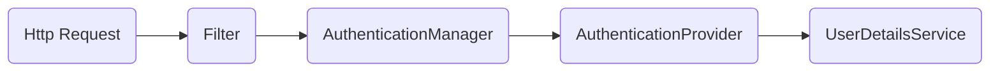

# 一、基础


## 1.1 处理步骤

如果一个请求到来，**SpringSecurity** 会按照以处理步骤。



1. **Filter**

   > 拦截Http请求，获取用户名和秘密等认证信息
   >
   > 
   >
   > 关键方法：
   >
   > ```java
   > public abstract Authentication attemptAuthentication(HttpServletRequest request, HttpServletResponse response)
   >         throws AuthenticationException, IOException, ServletException;
   > ```

2. **AuthenticationManager**

   > 从filter中获取认证信息，然后查找合适的AuthenticationProvider来发起认证流程
   >
   > 
   >
   > 关键方法：
   >
   > ```java
   > Authentication authenticate(Authentication authentication) throws AuthenticationException;
   > ```

3. **AuthenticationProvider**

   > 调用UserDetailsService来查询已经保存的用户信息并与从http请求中获取的认证信息比对。如果成功则返回，否则则抛出异常。
   >
   > 
   >
   > 关键方法：
   >
   > ```java
   > protected abstract UserDetails retrieveUser(String username, UsernamePasswordAuthenticationToken authentication)
   >             throws AuthenticationException;
   > ```

4. **UserDetailsService**

   > 负责获取用户保存的认证信息，例如查询数据库。
   >
   > 
   >
   > 关键方法：
   >
   > ```java
   > UserDetails loadUserByUsername(String username) throws UsernameNotFoundException;
   > ```


默认实现：

- **Filter：** UsernamePasswordAuthenticationFilter
- **AuthenticationManager：** ProviderManager
- **AuthenticationProvider：** DaoAuthenticationProvider
- **UserDetailsService：** InMemoryUserDetailsManager


# 二、配置


## 2.1 WebSecurityConfigurerAdaptor

1. anyRequest

   > 匹配所有请求路径

2. access

   > SpringEl表达式结果为true时可以访问

3. anonymous

   > 匿名可以访问

4. denyAll

   > 用户不能访问

5. fullyAuthenticated

   > 用户完全认证可以访问（非remember-me下自动登录）

6. hasAnyAuthority

   > 如果有参数，参数表示权限，则其中任何一个权限可以访问

7. hasAnyRole

   > 如果有参数，参数表示角色，则其中任何一个角色可以访问 

8. hasAuthority

   > 如果有参数，参数表示权限，则其权限可以访问

9. hasIpAddress

   > 如果有参数，参数表示IP地址，如果用户IP和参数匹配，则可以访问

10. hasRole

    > 如果有参数，参数表示角色，则其角色可以访问

11. permitAll

    > 用户可以任意访问

12. rememberMe

    > 允许通过remember-me登录的用户访问

13. authenticated

    > 用户登录后可访问
