[TOC]

# 一、概述

## 1.1 特点

艺术的特点：

1. 创意为王
2. 创作成本低
3. 无磨损
4. 创作成本高，复制成本低
5. 传播速度快
6. 容易被盗版侵权

软件的特点：

1. 是一种逻辑实体，具有抽象性
2. 软件的生产是开发而不是制造，没有明显的物理加工过程
3. 无硬件磨损
4. 对计算机系统有着不同程度的依赖
5. 软件本身是复杂的
6. 软件具有高昂的成本
7. 具备人的社会属性

所以软件即艺术

## 1.2 软件定义

国际定义：

与计算机系统操作有关的**计算机程序、规程、规则及任何与之有关的文档及数据**。 

古板定义：

软件是**计算机程序、用的数据**以及**有关的文档**的 **集合**

实际上：

软件是为 **满足人们的某种需求，被人开发，被人使用** 的集合体

> 在 程序+数据+文档 基础上，引入了人

> 上文所谓的 **文档**，是指不可执行的，与软件开发、运行、维护、使用和培训有关的图文材料

## 1.3 发展史

1. 60年代

   > 无软件概念，程序设计主要围绕硬件进行，规模很小

2. 70年代

   > 意大利面阶段，硬件环境相对稳定，出现了“软件作坊”。开始广泛使用产品软件（可购买），从而建立了软件的概念。软件危机产生

3. 80年代

   > 微处理器产生并广泛应用，分布式系统、嵌入智

4. 至今

   > 网络迅速普及，强大的桌面系统、面向对象技术、专家系统、人工智能、神经网络、虚拟现实……

## 1.4 软件危机

### 定义

* 计算机软件的开发和维护过程中所遇到的一系列严重问题
* 落后的软件生产方式无法满足迅速增长的计算机软件需求，从而导致的软件开发与维护过程中出现的一系列严重问题

### 表现

1. 软件开发进度难以预测

   > 进度

2. 软件开发成本难以控制

   > 成本

3. 用户对产品功能难以满足

   > 需求

4. 软件产品质量无法保证

   > 质量

5. 软件产品难以维护

   > 维护

6. 软件缺少适当的文档资料

   > 缺少说明文档

7. 软件成本在计算机系统成本中所占比例逐年上升

8. 软件开发生产率提高的速度，远远跟不上计算机应用迅速普及深入的趋势

   > 开发效率跟不上

### 原因

1. 缺乏软件开发的经验和有关软件开发数据的积累，使得开发工作的计划很难制定。致使经费预算常常突破，进度计划无法遵循，开发完成的期限一拖再拖。
2. 软件需求，在开发的初期阶段提得不够明确，或是未能得到确切的表达。开发工作开始后，软件人员和用户又未能及时交换意见，造成开发后期矛盾的集中暴露。
3. 开发过程没有统一的、公认的方法论和规范指导，参加的人员各行其事。加之设计和实现过程的资料很不完整；或忽视了每个人工作与其他人的接口，使得软件很难维护。
4. 未能在测试阶段充分做好检测工作，提交用户的软件质量差，在运行中暴露出大量的问题。

## 1.5 软件工程

### 定义

IEEE1993：将系统化的、规范的、可度量的方法应用于软件的开发、运行和维护的过程，即将工程应用到软件上。 

### 生命周期

1. 软件定义

   1. 问题定义

   2. 可行性研究和项目开发计划

   3. 需求分析

      > **需求分析的难点主要体现在以下几个方面：**
      >
      > •**（1）问题的复杂性；**
      >
      > •**（2）交流障碍；**
      >
      > •**（3）用户对问题的陈述不完备性和不一致性；**
      >
      > •**（4）需求易变性。**

2. 软件开发

   1. 概要设计

      > **概要设计的基本任务如下：** 
      >
      > **（1）设计软件系统的逻辑结构。**
      >
      > **（2）设计软件所需要的数据库系统** 
      >
      > **（3）编写概要设计文档** 
      >
      > **（4）评审** 
      >
      > **软件概要设计的几个基本原理：**
      >
      > **（1）抽象** 
      >
      > **（2）信息隐蔽**
      >
      > **（3）模块化** 

   2. 详细设计

      > **程序员会根据这些过程描述来编写程序代码**
      >
      > **（1）为每个模块进行详细的算法设计。这是需要用相应的工具来完成的，因为自然语言通常很容易具有“二义性”，而工具能做到含义唯一性；**
      >
      > **（2）为模块内的数据结构进行设计；**
      >
      > **（3）对数据库进行物理设计。**
      >
      > **（4）其它设计（前期特殊代码设计、I/O格式设计、界面友好设计等）；**
      >
      > **（5）编写详细设计说明书；**
      >
      > **（6）评审。**

   3. 编码

   4. 单元测试

   5. 综合测试

3. 运行维护

   > **使软件持久的满用户需求。**
   >
   > 运行维护分为：
   >
   > 1. 改正性维护： 运行中发现了软件中的错误需要修正
   > 2. 适应性维护：为了适应变化了的软件工作环境，需做适当变更
   > 3. 完善性维护：为了增强软件的功能需做变更

### 生命周期模型

1. 瀑布模型

   > **瀑布模型（waterfall model）是传统的软件工程生命周期模式，这种生存期模式是一种系统的和顺序的软件开发方法。它由系统可行性分析开始，跟着是软件需求分析、设计、编码、测试和维护。**
   >
   > •**阶段间具有顺序性和依赖性**
   >
   > •**推迟实现的观点**
   >
   > •**质量保证的观点**
   >
   > •**添加反馈环**
   >
   > •**实线箭头表示开发过程**
   >
   > •**虚线箭头表示维护过程**
   >
   > #### 优点
   >
   > - **可强迫开发人员采用规范的方法（例如，结构化技术）； 严格地规定了每个阶段必须提交的文档；要求每个阶段交出的所有产品都必须经过质量保证小组的仔细验证。**
   >
   > - **瀑布模型的成功在很大程度上是由于它基本上是一种文档驱动的模型。**
   >
   > #### 缺点
   >
   > - **“瀑布模型是由文档驱动的”这个事实也是它的一个主要缺点。在可运行的软件产品交付给用户之前，用户只能通过文档来了解产品是什么样的。**
   >
   > - **由于瀑布模型几乎完全依赖于书面的规格说明，很可能导致最终开发出的软件产品不能真正满足用户的需要。**
   >
   > #### 应用场景
   >
   > **一般适用于功能、性能明确、完整、无重大变化的软件系统的开发。例如操作系统、编译系统、数据库管理系统等系统软件的开发。**

2. 快速原型模型

   > **所谓快速原型是快速建立起来的可以在计算机上运行的程序，它所能完成的功能往往是最终产品能完成的功能的一个子集。**
   >
   > #### 优点
   >
   > - **快速原型模型是不带反馈环的，软件产品的开发基本上是线性顺序进行的。**
   >
   > - **原型系统的内部结构并不重要，重要的是，必须迅速地构建原型然后根据用户意见迅速地修改原型。**
   >
   > #### 缺点
   >
   > - **关注满足客户需求，可能导致系统设计差、效率低，难于维护**
   >
   > #### 应用场景
   >
   > **它适合于那些不能预先确切定义需求的软件系统的开发，更适合于那些项目组成员（包括分析员、设计员、程序员和用户）不能很好交流或通信有困难的情况。**

3. 增量模型

   > **增量模型也称为渐增模型。使用增量模型开发软件时，把软件产品作为一系列的增量构件来设计、编码、集成和测试。每个构件由多个相互作用的模块构成，并且能够完成特定的功能。**
   >
   > #### 优点
   >
   > * **它分批地逐步向用户提交产品，整个软件产品被分解成许多个增量构件，开发人员一个构件接一个构件地向用户提交产品。从第一个构件交付之日起，用户就能做一些有用的工作。**
   >
   > * **能在较短时间内向用户提交可完成部分工作的产品。**
   >
   > * **逐步增加产品功能可以使用户有较充裕的时间学习和适应新产品，从而减少一个全新的软件可能给客户组织带来的冲击。**
   >
   > #### 难点
   >
   > - **使用增量模型的困难是，在把每个新的增量构件集成到现有软件体系结构中时，必须不破坏原来已经开发出的产品。**
   >
   > - **必须把软件的体系结构设计得便于按这种方式进行扩充，向现有产品中加入新构件的过程必须简单、方便，也就是说，软件体系结构必须是开放的。**
   >
   > - **增量模型本身是自相矛盾的。**
   >
   > #### 应用场景
   >
   > -  进行已有产品升级或新版本开发，增量模型是非常适合的
   >
   > - 对完成期限严格要求的产品，可以使用增量模型
   >
   > - 对所开发的领域比较熟悉而且已有原型系统，增量模型也是非常合适的

4. 螺旋模型

   > **使用原型及其他方法来尽量降低风险。理解这种模型的一个简便方法，是把它看作在每个阶段之前都增加了风险分析过程的快速原型模型。**
   >
   > #### 应用场景
   >
   > **支持需求不明确、特别是大型软件系统的开发，并支持面向规格说明、面向过程、面向对象等多种软件开发方法，是一种具有广阔前景的模型。**

5. 喷泉模型

   > **喷泉模型与传统的结构化生存期比较，具有更多的增量和迭代性质，生存期的各个阶段可以相互重叠和多次反复，而且在项目的整个生存期中还可以嵌入子生存期。就像水喷上去又可以落下来，可以落在中间，也可以落在最底部。**

| 模型         | 优点                       | 缺点                                     | 应用场景                                                     |
| ------------ | -------------------------- | ---------------------------------------- | ------------------------------------------------------------ |
| 瀑布模型     | 文档驱动                   | 系统可能不满足用户需求                   | 适用于小规模项目，且要求明确的需求。                         |
| 快速原型模型 | 关注满足客户需求           | 可能导致系统设计差、效率低、难于维护     | 适用于需求不明确、用户需求变化频繁的项目，例如Web应用的开发。 |
| 增量模型     | 开发早期反馈及时，易于维护 | 需要开放的体系结构，可能会设计差、效率低 | 适用于大型和复杂项目，可以通过逐步增加功能来减少风险。       |
| 螺旋模型     | 风险驱动                   | 风险分析人员需要有经验且经过专业训练     | 适用于大型、高风险项目，如新技术的引入或具有复杂需求的项目。 |

# 二、可行性研究

## 2.1 任务

- 可行性研究的目的不是解决问题，而是确定问题**是否值得**去解决。

- 可行性研究实质上是要进行一次大大压缩**简化**了的系统分析和设计的过程，也就是在较高层次上以较抽象的方式进行的系统分析和设计的过程。

在澄清了问题定义之后，分析员应该导出系统的**逻辑模型**。探索若干种可供选择的主要解法，至少应该从下述三方面研究每种解法的可行性：

1. 技术可行性

2. 经济可行性

3. 操作可行性

## 2.2 过程

1. **复查系统规模和目标**
2. **研究目前正在使用的系统**
3. **导出新系统的高层逻辑模型**
4. **进一步定义问题**
5. **导出和评价供选择的解法**
6. **推荐行动方针**
7. **草拟开发计划**
8. **书写文档提交审查**

## 2.3 系统流程图

- 系统流程图是概括地描绘**物理系统**的传统工具。它的基本思想是用图形符号以黑盒子形式描绘组成系统的每个部件(程序，文档，数据库，人工过程等)。

- 系统流程图表达的是数据在系统各部件之间流动的情况，而不是对数据进行加工处理的控制过程，。

- 它是物理数据流图而不是程序流程图。

### 2.3.1 符号

### 2.3.2 系统流程图例题

**题目一**：装配厂使用一台小型计算机处理更新库存清单主文件和产生定货报告的任务。零件库存量的每一次变化称为一个**事务**，由放在仓库中的**CRT终端输入**到计算机中；系统中的**库存清单程序**对事务进行处理，更新存储在**磁盘**上的**库存清单主文件**，并且把必要的**定货信息**写在**磁带**上。最后，每天由**报告生成程序**读一遍**磁带**，并且**打印**出**定货报告**。

解答：

**题目二**：试画出现有图书管理系统借阅管理子系统流程图（假设现有系统为手工操作）

解答：

## 2.4 数据流图

定义：数据流图(Data Flow Diagram，DFD)是一种图形化技术，它描绘信息流和数据从输入移动到输出的过程中所经受的变换。

用规范的图元描述系统内部各个环节中数据如何联系、如何处理或流转，从系统级即顶层开始，逐层分解，画出数据流图，直到底层。

### 2.4.1 符号

（1）数据源点

- 位于系统之外的信息提供者或使用者，又称为外部实体或外部项。

- 存在于系统之外，但与系统相互作用的人员或组织或其他的系统。

- 表达该系统数据的外部来源和去处。

（2）处理

- 又称数据加工或数据处理；

- 指对数据的逻辑处理，也就是对数据的变换功能，即对数据进行的操作。

- 当有两部分时，一般上部是编号或编号+名称，下部是名称或功能简述。

（3）数据存储

- 数据存储是指某种数据保存后的逻辑统称，不是指保存数据的物理地点或物理介质。

- 数据存储一般仅属于某一层或某几层，又称为局部文件。

- 数据存储可以编号，用单开口的矩形框，通常以D开头

### 2.4.2 数据流与处理的关系

### 例题一

题目：一家工厂的**采购部**每天**需要**一张定货报表，报表按零件编号排序，表中列出所有需要再次定货的零件。对于每 个需要再次定货的零件应该列出下述数据：零件编号，零件名称，定货数量，目前价格，主要供应者，次要供应者。零件入库或出库称为事务，通过放在**仓库**中的 CRT 终端把事务**报告**给定货系统。当某种零件的库存数量少于**库存量临界值**时就应该再次定货。

解答：

顶层：

0层：

1层：

### 数据流图设计原创

1. **父图与子图的平衡原则**

   > 子图的输入输出数据流同父图对应加工的输入输出数据流必须一致，此即父图与子图的平衡。

2. **数据守恒原则**

   > 对不论什么一个加工来说，其全部输出数据流中的数据必须能从该加工的输入数据流中直接获得。或者说是通过该加工能产生的数据。
   >
   > 1. 外部实体与外部实体之间不存在数据流
   >
   > 2. 外部实体与数据存储之间不存在数据流
   >
   > 3. 数据存储与数据存储之间不存在数据流

3. **守恒加工原则** 

   > 对同一个加工来说，输入与输出的名字必须不同样。即使它们的组成成分同样。
   >
   > 1. 对于每一个加工，必须既有输入数据流。又有输出数据流。
   >
   > 2. 数据流与加工有关，且必须经过加工。

### 例题二

题目：目前住院病人主要由护士护理，这样做不仅需要大量护士，而且由于不能随时观察危重病人的病情变化，还会延误抢救时机。某医院打算开发一个以计算机为中心的患者监护系统，请写出问题定义，并且分析开发这个系统的可行性。

医院对患者监护系统的基本要求是随时**接收**每个病人的**生理信号**(脉搏、体温、血压、心电图等)，定时记录**病人情况以**形成患者日志**，当某个**病人**的生理信号**超出**医生规定的安全范围时向值班**护士发出警告**信息，此外，护士在需要时还可以要求系统**印出**某个指定病人的**病情报告。

解答：

顶层:

0层：

## 2.5 数据字典

定义：**数据字典（Data Dictionary）是对数据流图中各种成分描述、注释、说明的集合。**

**是对数据流图的重要补充。数据流图配以数据字典，从图形和文字两个方面对系统的逻辑模型进行完整的描述。**

**数据字典是需求收集和需求分析所获成果的表述之一。**

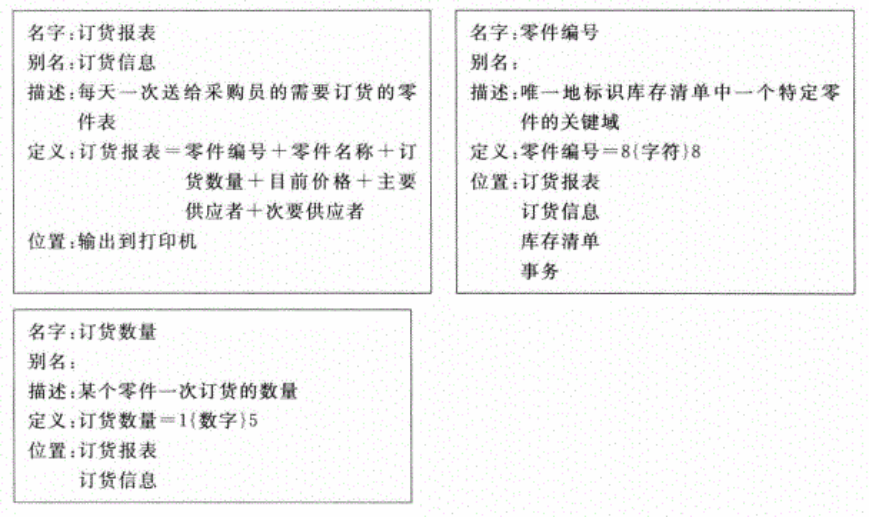

### 词条内容

1. 编号
2. 名字
3. 别名
4. 定义或描述
5. 分类
6. 位置
7. 其他

#### 条目类型

1. 数据项

   > 这里的数据项可以是最基础的数据项和组合后的数据结构。
   >
   > 数据项通常包含一下内容：
   >
   > ①**名称**
   >
   > ②**别名**
   >
   > ③**简要说明**
   >
   > ④**数据类型**
   >
   > ⑤**长度**
   >
   > ⑥**取值范围**
   >
   > ⑦**与其他数据项的逻辑关系（有关的数据流或数据结构）**
   >
   > eg：姓名
   >
   > 名称：姓名
   >
   > 别名：Name
   >
   > 简述：真实姓名
   >
   > 类型：字符串
   >
   > 长度：50
   >
   > 取值范围：一般人名三个汉字，考虑到少数民族的习惯，姓名可以多个汉字。
   >
   > 参与的数据结构：用户信息、客户信息。
   >
   > 
   >
   > 数据结构的描述通常包括以下内容：
   >
   > ①**名称**
   >
   > ②**别名**
   >
   > ③**简要说明**
   >
   > ④**组成：{数据项或数据结构}**
   >
   > > 连接符：
   > >
   > > =意思是等价于(或定义为)
   > >
   > > +意思是和(即，连接两个分量)
   > >
   > > [  ]意思是或(即，从方括弧内列出的若干个分量中选择一个)，通常用“|”号隔开供选择的分量
   > >
   > > {  }意思是重复(即，重复花括弧内的分量)
   > >
   > > (  )意思是可选(即，圆括弧里的分量可有可无)
   >
   > ⑤**有关的数据流或数据结构**

2. 数据流

   > 描述：
   > 1. 编号
   > 2. 名称
   > 3. 别名
   > 4. 简要说明
   > 5. 数据流来源数据流去向
   > 6. 组成：{数据项或数据结构}
   > 7. 流动属性：频率、平均流量、高峰流量
   >
   > 
   >
   > eg：工资单
   >
   > 编号：06
   >
   > 名称：职工工资单
   >
   > 别名：salary sheet
   >
   > 简述：职工月末工资明细单
   >
   > 来源：工资管理系统
   >
   > 去向：职工
   >
   > 组成：职工姓名+职工编号+工资年月+基础工资+绩效工资+应发合计+应扣合计+实发合计
   >
   > 流动属性：每月一次；每次数量为职工数。
   >
   > 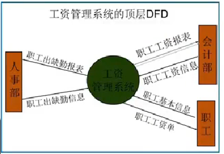

3. 文件（数据存储）

   > 描述
   > 1. 编号
   >
   > 2. 名称
   >
   > 3. 别名
   >
   > 4. 简要说明
   >
   > 5. 流入的数据流
   >
   > 6. 流出的数据流
   >
   > 7. 组成：{数据结构}和关键字
   >
   > 8. 流动属性：频率、数据量
   >
   > 9. 存取方式和安全性
   >
   >    
   >
   > eg：职工工资信息
   >
   > 编号：D03
   >
   > 名称：职工工资信息
   >
   > 别名：salary table
   >
   > 简述：职工工资数据记录
   >
   > 流入的数据流：P2.0 工资管理系统
   >
   > 流出的数据流：P2.0
   >
   > 组成：职工姓名+职工编号+工资年月+基础工资+绩效工资+应发合计+应扣合计+实发合计关键字：职工编号
   >
   > 流动属性：每月一次；每次数量为职工数
   >
   > 存取方式：索引文件，实时查询；
   >
   > 安全性：授权更新

4. 加工（处理）

   > eg：制作职工出勤信息统计表
   >
   > 编号：P3.2
   >
   > 名称：制作职工出勤信息统计表
   >
   > 别名：attendance statistics
   >
   > 简要说明：编制职工出勤信息统计表
   >
   > 输入数据流：职工基本信息、职工出勤信息
   >
   > 输出数据流：职工出勤统计表
   >
   > 处理逻辑：1、检查职工出勤信息  2、统计出勤情况。
   >
   > 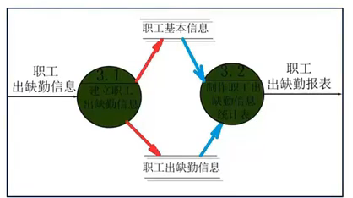

5. 外部实体

   > eg：职工
   >
   > 编号：01
   >
   > 名称：职工
   >
   > 别名：staff
   >
   > 简要说明：工资管理中最基础的对象
   >
   > 产生的数据流：职工基本信息
   >
   > 接受的数据流：工资单
   >
   > 数量：1000

## 2.6 成本效益分析

目的：效益分析的目的正是要从经济角度分析开发一个特定的新系统是否划算，从而帮助客户组织的负责人正确地作出是否投资于这项开发工程的决定。

1. 成本估计

   > 软件开发成本主要表现为人力消耗(乘以平均工资则得到开发费用)。下面简单介绍3种估算技术。
   >
   > 1. 代码行技术---当有以往开发类似工程的历史数据可供参考时，这个方法是非常有效的。
   > 2. 任务分解技术---首先把软件开发工程分解为若干个相对独立的任务。再分别估计每个单独的开发任务的成本，最后累加起来得出软件开发工程的总成本。
   > 3. 自动估计成本技术---采用这种技术必须有长期搜集的大量历史数据为基础，并且需要有良好的数据库系统支持。

2.  成本/效益分析的方法

   > 成本/效益分析的第一步是估计开发成本、运行费用和新系统将带来的经济效益。运行费用取决于系统的操作费用(操作员人数，工作时间，消耗的物资等等)和维护费用。
   >
   > 1. 货币的时间价值
   >
   >    > 通常用利率的形式表示货币的时间价值。假设年利率为i，如果现在存入P元，则n年后可以得到的钱数为：F=P(1+i)n如果n年后能收入F元钱，那么这些钱的现在价值是：P=F/(1+i)n
   >
   > 2. 投资回收期
   >
   >    > 所谓投资回收期就是使累计的经济效益等于最初投资所需要的时间。投资回收期越短就能越快获得利润，因此这项工程也就越值得投资。
   >
   > 3. 纯收入
   >
   >    > 在整个生命周期之内系统的累计经济效益(折合成现在值)与投资之差。
   >    >
   >    > 这相当于比较投资开发一个软件系统和把钱存在银行中(或贷给其他企业)这两种方案的优劣。
   >    >
   >    > 如果纯收入小于零，那么这项工程显然不值得投资。
   >
   > 4. 投资回收率
   >
   >    > 可以计算投资回收率，用它衡量投资效益的大小，并且可以把它和年利率相比较，在衡量工程的经济效益时，它是最重要的参考数据。

3. 例题

   > 图书管理系统
   >
   > 投资成本：一次性支出总费用：47万元。
   >
   > （1）系统开发、建立费用共23万元。
   >
   > - 本系统开发期为7个月，需开发人员6人（不一定都是参加满7个月）。根据软件系统的规模估算，开发工作量约为30人月，每人月的人工费按5000元计算，开发费用为15万元。
   > - 书籍、读者等基础信息建立需要20人2个月即40人月，每人月的人工费用按2000元计算，需8万元。
   >
   > （2）硬件设备费共13万元，其中：微机6台约3万元；服务器3台及网络等设备费10万元。
   >
   > （3）外购开发工具、软件环境费用共9万元。
   >
   > （4）其他费费用共2万元。
   >
   > 
   >
   > 投资成本：经常性费用主要是系统运行费用，假设本系统运行期10年，每年的运行费用(包括系统维护、设备维护等)5万元，按年利率5%计算如下表。
   >
   > 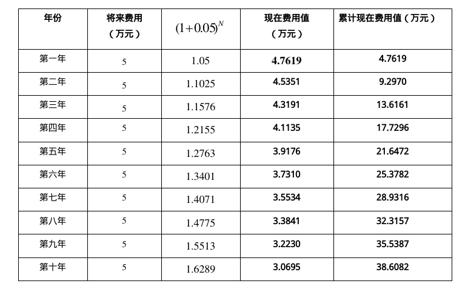
   >
   > 系统投资成本总额为：47+38.6082=85.6082万元。
   >
   > 
   >
   > 收益：假设投入本系统，效率可以提高50%，以现有的工作人员20人计算，可减少10人，每人每月平均工资按2500元计算，每年节约人员工资10×12×0.25=30万元/年。按年利率5%计算，效益计算如下表。
   >
   > 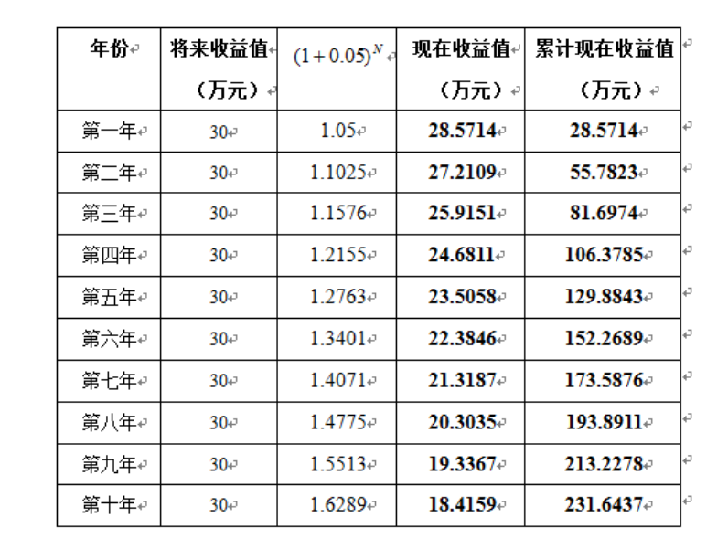
   >
   > 成本/收益分析：
   >
   > 在10年期内，系统总成本85.6082万元，系统总收益231.6437万元。
   >
   > 投资回收期：3+（85.6082－81.6974）/24.6811=3.12年；
   >
   > 投资回报率：×％  (即为$85.6082=30/(1+j)+30/(1+j)^2+…+30/(1+j)^{10}$的方程解j×100)
   >
   > 纯收益：231.6437－85.6082＝146.0355万元

# 三、需求分析

需求分析是软件定义时期的最后一个阶段，它的基本任务是准确地回答“系统必须做什么?”这个问题。

需求分析的任务还不是确定系统怎样完成它的工作，而仅仅是确定系统必须完成哪些工作，也就是对目标系统提出完整、准确、清晰、具体的要求。

在需求分析阶段结束之前，系统分析员应该写出**软件需求规格说明书**，以书面形式准确地描述软件需求。

所有这些分析方法都遵守下述准则：

(1) 必须理解并描述问题的信息域，根据这条准则应该建立**数据模型**。

(2) 必须定义软件应完成的功能，这条准则要求建立**功能模型**。

(3) 必须描述作为外部事件结果的软件行为，这条准则要求建立**行为模型**。

(4) 必须对描述信息、功能和行为的模型进行分解，用层次的方式展示细节。

## 3.1 任务

确定系统的综合需求

1. 功能需求
2. 性能需求
3. 可靠性和可用性需求
4. 出错处理需求
5. 接口需求
6. 约束
7. 逆向需求
8. 将来可能提出的要求

访谈问什么？ 

（1） 功能需求：系统做什么？系统何时做什么？系统何时及如何修改或升级？  

（2） 性能需求：软件开发的技术性指标：例如：存储容量限制；执行速度、相应时间、吞吐量。 

（3）环境需求：硬件设备：机型、外设、接口、地点、分布、温度、湿度、磁场干扰等;软件操作系统；网络；数据库。

（4）界面需求：有来自其他系统的输入吗？到自其他系统的输出吗？对数据格式有规定吗？对数据存储介质有规定吗？

（5） 用户或人的因素：用户类型？各种用户熟练程度？需受何种训练？用户理解、使用系统的难度？用户错误操作系统的可能性？    

（6）文档需求：需哪些文档？文档针对哪些读者？

（7） 数据需求：输入、输出数据的格式？接收、发送数据的频率？数据的准确性和精度？ 数据流量？数据需保持的时间？

（8） 资源需求：软件运行时所需的数据、软件。内存空间等资源。软件开发、维护所需的人力、支撑软件、开发设备等。

## 3.2 面向数据自顶向下求精

进一步细化可行性研究阶段获得的高层数据流图。建立详细的数据流图、描绘数据在软件系统内从输入移动到输出的过程中受到的变化；

1. 数据字典：定义数据流图总包含的元素；

2. 实体关系图：从用户角度描述数据；

3. IPO图：描述数据流图中处理框的功能和算法。

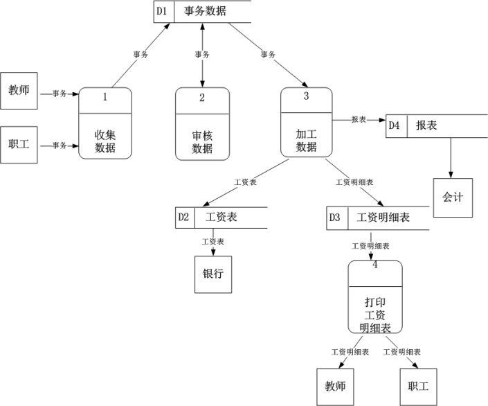

## 3.3 E-R图

概念性数据模型是一种面向问题的数据模型，是按照用户的观点对数据建立的模型。它描述了从用户角度看到的数据，它反映了用户的现实环境，而且与在软件系统中的实现方法无关。

数据模型中包含3种相互关联的信息：数据对象、数据对象的属性及数据对象彼此间相互连接的关系。

### 3.3.1 数据对象

- 数据对象是对软件必须理解的复合信息的抽象。所谓复合信息是指具有一系列不同性质或属性的事物，仅有单个值的事物(例如，宽度)不是数据对象。

- 数据对象可以是外部实体(例如，产生或使用信息的任何事物)、事物(例如，报表)、行为(例如，打电话)、事件(例如，响警报)、角色(例如，教师、学生)、单位(例如，会计科)、地点(例如，仓库)或结构(例如，文件)等。总之，可以由一组属性来定义的实体都可以被认为是数据对象。

- 数据对象彼此间是有关联的，例如，教师“教”课程，学生“学”课程，教或学的关系表示教师和课程或学生和课程之间的一种特定的连接。

### 3.3.2 属性

属性定义了数据对象的性质。必须把一个或多个属性定义为“标识符”，也就是说，当我们希望找到数据对象的一个实例时，用标识符属性作为“关键字”(通常简称为“键”)。应该根据对所要解决的问题的理解，来确定特定数据对象的一组合适的属性。

### 3.3.3 联系

联系：数据对象彼此之间相互连接的方式称为联系，也称为关系。联系可分为以下3种类型：

(1) 一对一联系(1∶1)例如，一个部门有一个经理，而每个经理只在一个部门任职，则部门与经理的联系是一对一的。

(2) 一对多联系(1∶N)例如，某校教师与课程之间存在一对多的联系“教”，即每位教师可以教多门课程，但是每门课程只能由一位教师来教。

(3) 多对多联系(M∶N)例如，学生与课程间的联系(“学”)是多对多的，即一个学生可以学多门课程，而每门课程可以有多个学生来学。

**某校教学管理ER图**

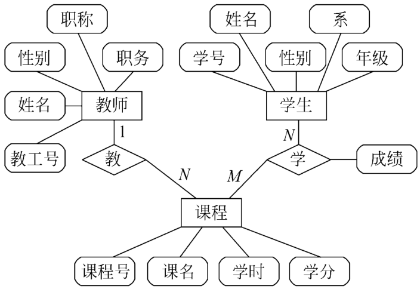

## 3.4 状态转换图

- 通过描绘系统的状态及引起系统状态转换的事件，来表示系统的行为。

- 状态图还指明了作为特定事件的结果系统将做哪些动作(例如，处理数据)。

### 3.4.1 状态

 状态：是任何可以被观察到的系统行为模式，一个状态代表系统的一种行为模式。状态规定了系统对事件的响应方式。系统对事件的响应，既可以是做一个(或一系列)动作，也可以是仅仅改变系统本身的状态，还可以是既改变状态又做动作。

状态主要有：初态(即初始状态)，只能有1个终态(即最终状态)，可以有0至多个中间状态

状态图分类：

1. 表示系统循环运行过程，通常不关心循环是怎样启动的。
2. 表示系统单程生命期，需要标明初始状态和最终状态。

### 3.4.2 事件

事件：是在某个特定时刻发生的事情，它是对引起系统做动作或(和)从一个状态转换到另一个状态的外界事件的抽象。简而言之，事件就是引起系统做动作或(和)转换状态的控制信息。例如，用户移动或点击鼠标等都是事件。

### 3.4.3 符号

初态：用实心圆表示；

终态：用一对同心圆(内圆为实心圆)表示；

中间状态：用圆角矩形表示，分成上、中、下3部分。上面部分-----为状态的名称；中间部分-----为状态变量的名字和值；下面部分-----是活动表。 

带箭头的连线：称为状态转换，箭头指明了转换方向。状态变迁通常是由事件触发的，在这种情况下应在表示状态转换的箭头线上标出触发转换的事件表达式；如果在箭头线上未标明事件，则表示在源状态的内部活动执行完之后自动触发转换。 

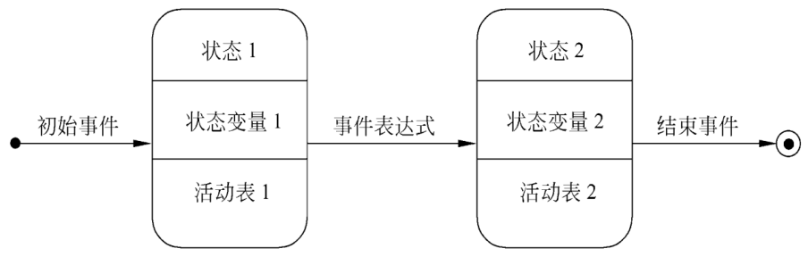

### 3.4.4 实例

没有人打电话时电话处于**闲置状态**，有人拿起听筒则进入**拨号音状态**，到达这个状态后电话的行为是**响起拨号音并计时**，这时如果拿起听筒的人不想打了，他把听筒放下（挂断），电话又重回到**闲置状态**，如果拿起听筒很长时间不拨号（超时），则进入**超时状态**。

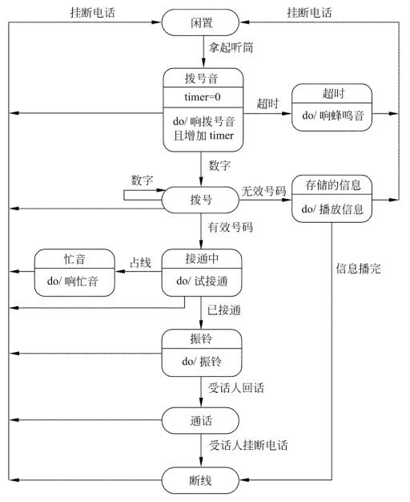

复印机的工作过程大致如下：未接到复印命令时处于**闲置状态**，一旦接到复印命令则进入**复印状态**，完成一个复印命令规定的工作后又回到闲置状态，等待下一个复印命令；如果执行复印命令时发现没纸，则进入**缺纸状态**，**发出警告，等待装纸**，装满纸后进入闲置状态，准备接收复印命令；如果复印时**发生卡纸故障**，则进入**卡纸状态**，**发出警告等待维修人员来排除故障**，故障排除后回到闲置状态

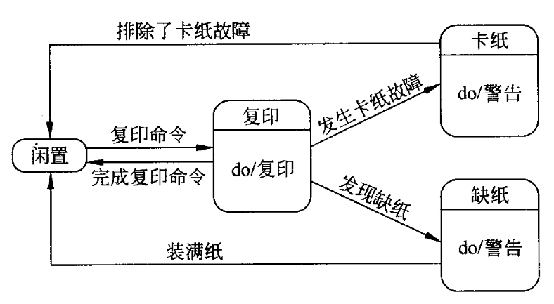

## 3.5 层次方框图

层次方框图用树形结构的一系列多层次的矩形框描绘数据的层次结构。树形结构的顶层是一个单独的矩形框，它代表完整的数据结构，下面的各层矩形框代表这个数据的子集，最底层的各个框代表组成这个数据的实际数据元素(不能再分割的元素)。

例如，描绘一家计算机公司全部产品的数据结构可以用下图层次方框图表示。这家公司的产品由硬件、软件和服务3类产品组成，软件产品又分为系统软件和应用软件，系统软件又进一步分为操作系统、编译程序和软件工具等。

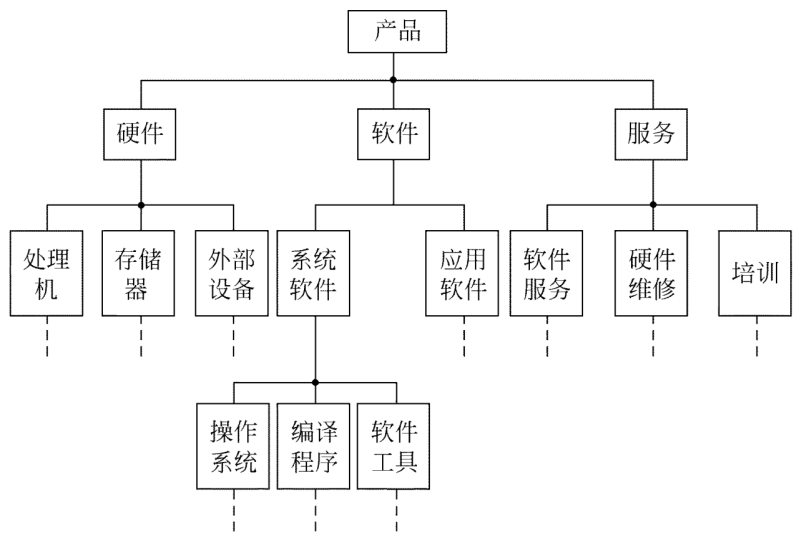

## 3.6 Warnier图

- 和层次方框图类似，Warnier图也用树形结构描绘信息，但是这种图形工具比层次方框图提供了更丰富的描绘手段。

- 用Warnier图可以表明信息的逻辑组织，也就是说，它可以指出一类信息或一个信息元素是重复出现的，也可以表示特定信息在某一类信息中是有条件地出现的。很容易把Warnier图转变成软件设计的工具。

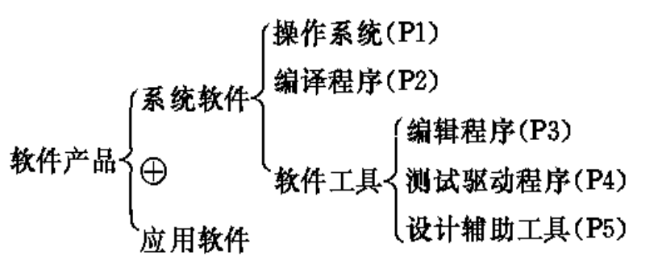

## 3.7 IPO图

IPO图是输入、处理、输出图的简称，它是美国IBM公司发展完善起来的一种图形工具，能够方便地描绘输入数据、对数据的处理和输出数据之间的关系

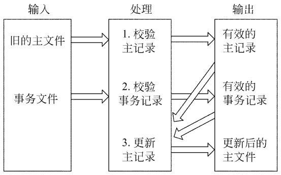

使用一种改进的IPO图(也称为IPO表)，这种图中包含某些附加的信息，在软件设计过程中将比原始的IPO图更有用。

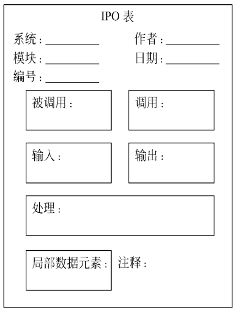

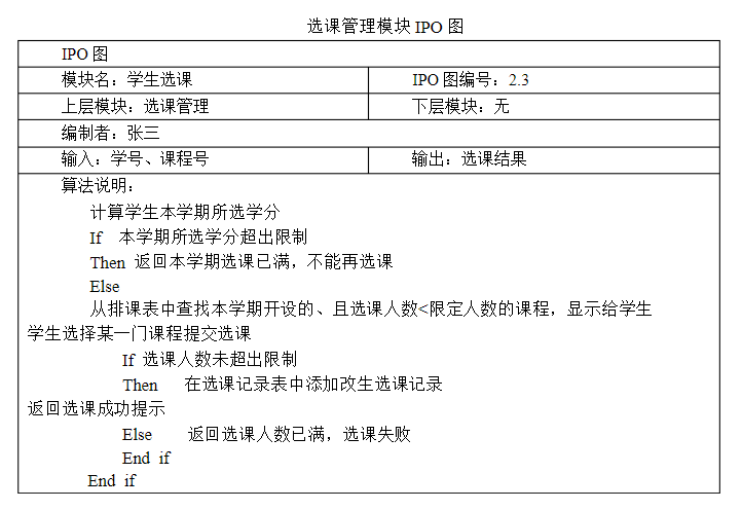

## 3.8 验证软件需求的方法

大量统计数字表明，软件系统中15%的错误起源于错误的需求。

应该从下述4个方面进行验证：

1. 一致性
2. 完整性
3. 现实性
4. 有效性

## 3.9 案例

顶层：

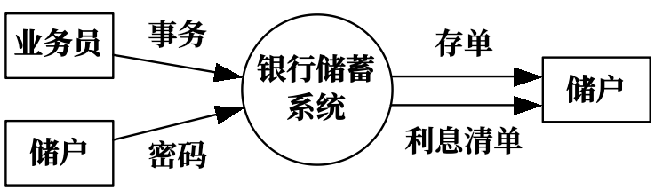

0层：

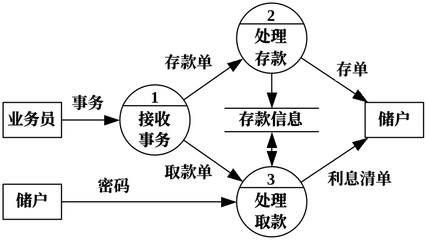

细化后：

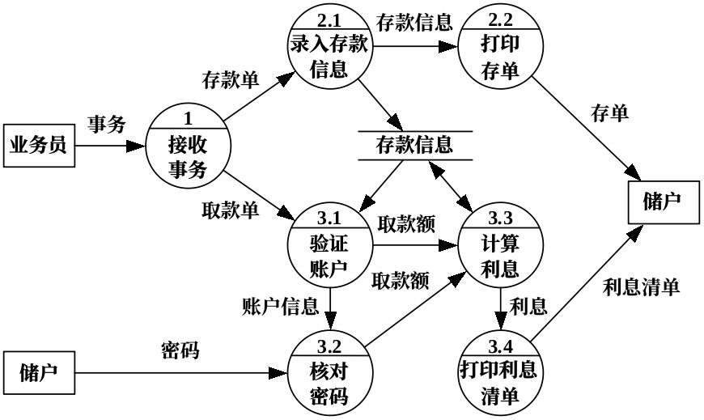

ER图：

存款过程：

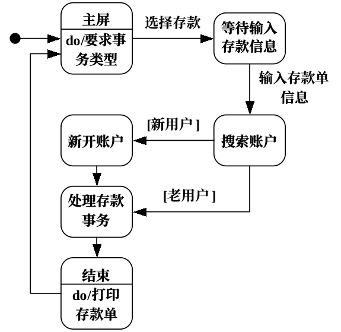

取款过程：

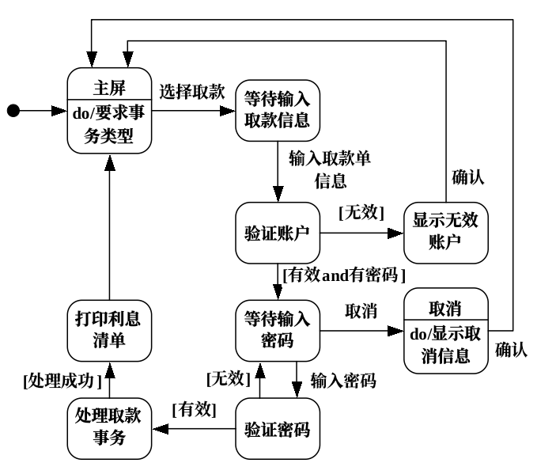

# 四、总体设计

- **传统的结构化方法**将软件设计划分为**体系结构设计、数据设计、接口设计及过程设计**四部分；

- **面向对象方法**则将软件设计划分为**体系结构设计、类设计/数据设计、接口设计、构件级设计**四部分。

## 4.1 模块独立性

模块独立开发具有独立功能而且和其他模块之间没有过多的相互作用的模块，就可以做到模块独立。

- 模块的独立性的优点：

  - 有效的模块化(即具有独立的模块)的软件比较容易开发出来。

  - 独立的模块比较容易测试和维护。

- 模块的独立程度可以由两个定性标准度量，这两个标准分别称为**耦合**和**内聚**。

**耦合**是模块之间的互相连接的紧密程度的度量。 

**内聚**是模块功能强度(一个模块内部各个元素彼此结合的紧密程度)的度量。

模块独立性比较强的模块应是高内聚低耦合的模块。

耦合分类：从低到高耦合

1. 非直接耦合(Nondirect Coupling) 

   > 两个模块之间没有直接关系，它们之间的联系完全是通过主模块的控制和调用来实现的。非直接耦合的模块独立性最强。

2. 数据耦合 (Data Coupling)

   > 一个模块访问另一个模块时，彼此之间是通过简单数据参数 (不是控制参数、公共数据结构或外部变量)  来交换输入、输出信息的。
   >
   > 数据耦合是低耦合。一般说来，一个系统内可以只包含数据耦合

3. 标记耦合 (Stamp Coupling)

   > 一组模块通过参数表传递记录信息，就是标记耦合。这个记录是某一数据结构的子结构，而不是简单变量。
   >
   > 高级语言的数组名、记录名、文件名等这些名字即为标记，其实传递的是这个数据结构的地址。

4. 控制耦合 (Control Coupling)

   > 如果一个模块通过传送开关、标志、名字等控制信息，明显地控制选择另一模块的功能，就是控制耦合。

5. 外部耦合（External Coupling）

   > 一组模块都访问同一全局简单变量而不是同一全局数据结构，而且不是通过参数表传递该全局变量的信息，则称之为外部耦合。

6. 公共耦合（Common Coupling）

   > 若一组模块都访问同一个公共数据环境，则它们之间的耦合就称为公共耦合。
   >
   > 公共的数据环境可以是全局数据结构、共享的通信区、内存的公共覆盖区等。
   >
   > 公共耦合的复杂程度随耦合模块的个数增加而显著增加。若只是两模块间有公共数据环境，则公共耦合有两种情况。松散公共耦合和紧密公共耦合。

7. 内容耦合 (Content Coupling)

   > 如果发生下列情形，两个模块之间就发生了内容耦合:
   >
   > (1) 一个模块直接访问另一个模块的内部数据;    
   >
   > (2) 一个模块不通过正常入口转到另一模块内部;    
   >
   > (3) 两个模块有一部分程序代码重迭(只可能出现在汇编语言中);    
   >
   > (4) 一个模块有多个入口（多种功能）
   >
   > 应该坚决避免使用内容耦合。许多高级程序设计语言已经设计成不允许在程序中出现任何形式的内容耦合。

内聚性分类:	内聚性从高到低

1. 功能内聚    (Functional Cohesion)

   > 一个模块中各个部分都是**完成某一具体功能**必不可少的组成部分，或者说该模块中所有部分都是为了完成一项具体功能而协同工作，紧密联系，不可分割的。则称该模块为功能内聚模块。

2. 信息内聚    (Informational Cohesion)

   > 这种模块完成**多个功能**，各个功能都在**同一数据结构上**操作，每一项功能有一个唯一的入口点。这个模块将根据不同的要求，确定该执行哪一个功能。由于这个模块的所有功能都是基于同一个数据结构（符号表），因此，它是一个信息内聚的模块。

3. 通信内聚   (Communication Cohesion)

   > 如果一个模块内各功能部分都使用了**相同的输入数据**，或产生了**相同的输出数据**，则称之为通信内聚模块。通常，通信内聚模块是通过数据流图来定义的。例如报表打印模块，各部分都从若干共同的数据来源接收数据，然后转换、汇总并打印出各种报表。

4. 过程内聚  （Procedural Cohesion）

   > 使用流程图做为工具设计程序时，把流程图中的某一部分划出组成模块，就得到过程内聚模块。
   >
   > 例如，假设有一个子程序，它产生读取雇员的名字，然后是地址，最后是它的电话号码。这种顺序之所以重要，仅仅是因为它符合用户的要求，用户希望按这种顺序进行屏幕输入。 

5. 时间内聚  （Classical Cohesion）

   > 时间内聚又称为经典内聚。这种模块大多为多功能模块，但模块的各个功能的执行与时间有关，通常要求所有功能必须在同一时间段内执行。例如初始化模块和终止模块。

6. 巧合内聚（Coincidental Cohesion）

   > 巧合内聚 (偶然内聚)。当模块内各部分之间没有联系，或者即使有联系，这种联系也很松散，   则称这种模   块为巧合内   聚模块，它   是内聚程度   最低的模块

高内聚：1.功能内聚、2.信息内聚

中内聚：1.通信内聚、2.过程内聚

## 4.2 模块设计启发规则

1. 改进**软件结构**提高模块独立性

   > 设计出软件的初步结构以后，应该审查分析这个结构，通过模块分解或合并，力求降低耦合提高内聚。

2. 模块**规模**应该适中

   > 一个模块的规模不应过大，最好能写在一页纸内(通常不超过60行语句)

3. 深度、宽度、扇出和扇入都应适当

   > 深度：软件结构中控制的层数
   >
   > 宽度：软件结构内同一个层次上的模块总数的最大值
   >
   > 扇出：一个模块直接控制(调用)的模块数目
   >
   > 扇入：一个模块被多少个上级模块直接调用的数目

4. 模块的作用域应该在控制域之内

   > 作用域：受该模块内一个判定影响的所有模块的集合。
   >
   > 控制域：模块本身以及所有直接或间接从属于它的模块的集合。

5. 力争降低模块接口的复杂程度

   > 模块接口复杂是软件发生错误的一个主要原因。应该仔细设计模块接口，使得信息传递简单并且和模块的功能一致。

6. 设计单入口单出口的模块

   > 这条启发式规则警告软件工程师不要使模块间出现内容耦合。当从顶部进入模块并且从底部退出来时，软件是比较容易理解的，因此也是比较容易维护的。

7. 模块功能应该可以预测

   > 模块的功能应该能够预测，但也要防止模块功能过分局限。

## 4.3 层次图

层次图用来描绘软件的层次结构。层次图的形式和第3.7节中介绍的描绘数据结构的层次方框图相同，但是表现的内容却完全不同。

层次图中的一个**矩形框代表一个模块**，方框间的**连线表示调用关系**而不像层次方框图那样表示**组成关系**。

## 4.4 HIPO图

HIPO图是美国IBM公司发明的“层次图加输入/处理/输出图”的英文缩写。为了能使HIPO图具有可追踪性，在H图(层次图)里除了最顶层的方框之外，每个方框都加了编号。

和H图中每个方框相对应，应该有一张IPO图描绘这个方框代表的模块的处理过程。

### 4.4.1 案例分析

请根据某企业订单处理系统的数据流图（如下图），应用HIPO图法进行模块层次功能分解。

（1）根据DFD把模块分解为输入、处理、输出三个功能模块，得到总体IPO图。

（2）根据总体IPO图将各模块逐层进行功能分解，画HIPO图。模块的执行顺序是从上到下，由左向右。

（3）在HIPO图基础上，绘制低层主要模块的IPO图，作为程序模块结构设计的依据。

## 4.5 结构图

结构图反映程序中模块之间的层次调用关系和联系：它以特定的符号表示模块、模块间的调用关系和模块间信息的传递

1. 模块：模块用矩形框表示，并用模块的名字标记它。
    

2. 模块的调用关系和接口

  > 模块之间用单向箭头联结，箭头从调用模块指向被调用模块。

3. 模块间的信息传递

   > 当一个模块调用另一个模块时，调用模块把数据或控制信息传送给被调用模块，以使被调用模块能够运行。而被调用模块在执行过程中又把它产生的数据或控制信息回送给调用模块

4. 在模块M的箭头尾部标以一个菱形符号，表示模块M有条件地调用模块A和模块B。当一个在调用箭头尾部标以一个弧形符号，表示模块M反复调用模块A、B、C。

## 4.6 面向数据流的设计方法

系统分析阶段，采用结构化分析方法得到了由数据流图、数据字典和加工说明等组成的系统的逻辑模型。在系统设计阶段，可根据一些规则从数据流图导出系统初始的模块结构图。

**根据数据流图描绘信息在系统中加工和流动的情况定义一些不同的“映射”，利用这些映射把数据流图变换成软件结构。**信息流的类型决定了映射的方法。

### 4.6.1 变换流

信息沿输入通路（可能包含多个处理）进入系统，同时由外部形式变换内部形式。进入系统的信息通过变换中心（在DFD中呈现为多个处理组成），经过加工处理以后再沿输出通路（包含多个处理）变换成外部形式离开软件系统。

### 4.6.2 事务流

数据沿输入通路到达一个处理T（事务中心），这个处理接收输入数据（事务），分析每个事务类型，根据事务类型在若干个动作序列中选出一个来执行。

完成下述任务：

(1)接收输入数据(输入数据又称为事务)。

(2) 分析每个事务以确定它的类型。

(3) 根据事务类型选取一条活动通路。

## 4.7 结构设计实例

银行计算机储蓄系统的工作过程大致如下：储户填写的**存款单**或**取款单**由业务员键入系统，如果是**存款**则系统记录存款人姓名、住址(或电话号码)、身份证号码、存款类型、存款日期、到期日期、利率及密码(可选)等**信息**，并**印出存单**给储户；如果是**取款**而且存款时留有**密码**，则系统首先**核对储户密码**，若密码正确或存款时未留密码，则系统**计算利息并印出利息清单**给储户。

**第一步：对银行储蓄系统的数据流图进行细化**

**第二步：确定数据流图具有变换特性还是事务特性。**

**第三步：确定输入流和输出流的边界**

**第四步：完成第一级分解**

**第五步：完成第二级分解**

**第六步：对软件结构进行精化**

# 五、详细设计

## 5.1 概述

详细设计阶段的根本目标是确定应该怎样具体地实现所要求的系统。

详细设计阶段的任务还不是具体地编写程序，而是要设计出程序的“蓝图”，以后程序员将根据这个蓝图写出实际的程序代码。

详细设计阶段是给出软件模块结构中各个模块内部过程描述，根据这些描述，程序员就能很快地写出程序来。

## 5.2 结构程序设计

1965年结构程序设计的概念最早由E.W.Dijkstra提出：程序的质量与程序中所包含的GO TO 语句的数量成反比

1966年Bohm和Jacopini证明了只用“顺序”、“选择”和“循环”控制结构就能实现任何单入口单出口的程序。

实际上用顺序结构和循环结构(又称DO-WHILE结构)完全可以实现选择结构(又称IF-THEN-ELSE结构) ，因此，理论上**最基本的控制结构只有两种**。

> 结构程序设计经典**定义**：如果一个程序的代码块仅仅通过顺序、选择和循环这3种基本控制结构进行连接，并且每个代码块只有一个入口和一个出口，则称这个程序是结构化的。
>
> 结构程序设计**更全面**的定义：结构程序设计是尽可能少用GO TO语句的程序设计方法。最好仅在检测出错误时才使用GO TO语句，而且应该总是使用前向GO TO语句。

经典的结构程序设计：只允许使用**顺序、IF-THEN-ELSE型分支和DO-WHILE型循环**这3种基本控制结构。

扩展的结构程序设计：除了上述3种基本控制结构之外，还允许使用**DO-CASE型多分支结构和DO-UNTIL型循环**结构

修正的结构程序设计：再允许使用**LEAVE(或BREAK)**结构

 

## 5.3 过程设计的工具

### 5.3.1  程序流程图

程序流程图又称为程序框图，它的主要优点是对控制流程的描绘很直观，便于初学者掌握。由于程序流程图历史悠久，为最广泛的人所熟悉，尽管它有种种缺点，但至今仍在广泛使用着。总的趋势是越来越多的人不再使用程序流程图了。

主要缺点：

- 程序流程图本质上不是逐步求精的好工具；

- 中用箭头代表控制流，因此程序员不受任何约束。

- 不易表示数据结构。

### 5.3.2 盒图（N-S图）

在使用过程中，人们发现流程线不一定是必需的，随着结构化程序设计方法(structured programming, SP）的出现，1973年美国学者**Ike Nassi**和**Ben Shneiderman**提出了一种新的流程图形式，这种流程图完全去掉了流程线，算法的每一步都用一个矩形框来描述，把一个个矩形框按执行的次序连接起来就是一个完整的算法描述。这种流程图同两位学者名字的第一个字母来命名，称为**N-S流程图**。

### 5.3.3 PAD图

PAD是问题分析图(problem analysis diagram)的英文缩写。它用二维树形结构的图来表示程序的控制流，将这种图翻译成程序代码比较容易。

PAD图是面向高级程序设计语言的，由于每种控制语句都有一个图形符号与之对应，将PAD图转换成与之对应的高级语言程序比较容易。

(a)顺序(先执行P1后执行P2)；

(b)选择(IF C THEN P1 ELSE P2); 

(c)CASE型多分支；

(d)WHILE型循环(WHILE C DO P);

(e)UNTIL型循环(REPEAT P UNTIL C)； 

(f)语句标号；

(g)定义

#### 一个例子

#### 特征：

1)结构清晰，结构化程度高；

2)易于阅读

3)最左端的纵线是程序主干线，对应程序的第一层结构；每增一层PAD图向右扩展一条纵线，帮程序的纵线数等于程序层次数。

4)程序执行：从PAD图最左主干线上端结点开始，自上而下、自左向右依次执行，程序终止于最左主干线。

### 5.3.4 判定表

当算法中包含多重嵌套的条件选择时，判定表能够清晰地表示复杂的条件组合与应做的动作之间的对应关系。

一张判定表由4部分组成，**左上部列出所有条件，左下部是所有可能做的动作，右上部是表示各种条件组合的一个矩阵，右下部是和每种条件组合相对应的动作**。判定表右半部的每一列实质上是一条规则，规定了与特定的条件组合相对应的动作。

例题：

用判定表表示教师课时津贴费规定

某校对各种不同职称教师，根据其是本校专职教师还是外聘兼职教师，决定其讲课的课时津贴费。本校专职教师每课时津贴费：教授 80 元，副教授 60 元，讲师 50 元，助教40 元。外聘兼职教师每课时津贴费：教授 90 元，副教授 80 元，讲师60 元，助教 50 

### 5.3.5 判定树

- 判定表虽然能清晰地表示复杂的条件组合与应做的动作之间的对应关系，但其含义却不是一眼就能看出来的，初次接触这种工具的人理解它需要有一个简短的学习过程。

- 当数据元素的值多于两个时，判定表的简洁程度也将下降。

- 判定树是判定表的变种，也能清晰地表示复杂的条件组合与应做的动作之间的对应关系。

#### 示例

### 5.3.6 PDL（过程设计语言）

- 过程设计语言（PDL）也称为伪码，这是一个笼统的名称，现在有许多种不同的过程设计语言在使用。它是用正文形式表示数据和处理过程的设计工具。

- PDL具有严格的关键字**外部语法**，用于定义控制结构和数据结构；另一方面，PDL表示实际操作和条件的**内部语法**通常又是灵活自由的，可以适应各种工程项目的需要。

语法是开放式的，其外层语法是确定的，而内层语法则故意不确定。

外层语法描述控制结构，它用类似于一般编程语言控制结构的关键字(如 IF—THEN —ELSE、WHILE—DO、REPEAT—UNTIL等)表示，所以是确定的。

内层语法描述具体操作，考虑到不同软件系统的实际操作种类繁多，内层语法故意不确定，实际上任意中英文语句都可用来描述所需的具体操作。

### 5.3.7 练习

**将下述模块的流程图描述转换为PAD和N-S图描述**

## 5.4 面向数据结构的设计方法

### 5.4.1 Jackson图

**优点：**

- **便于表示层次结构，而且是对结构进行自顶向下的有力工具。**

- **形象直观可读性好。**

- **既能表示数据结构也能表示程序结构。**

**缺点：**

- **表示选择或重复结构时，选择条件或循环结束条件不能直接在图上表示出来。**

数据的逻辑结构：

改进后：

### 5.4.2 Jacson法：

(1) 分析并确定输入数据和输出数据的逻辑结构，并用Jackson图描绘这些数据结构。

(2) 找出输入数据结构和输出数据结构中有对应关系的数

(3) 用下述3条规则从描绘数据结构的Jackson图导出描绘程序结构的Jackson图。

> ① 为每对有对应关系的数据单元，按照它们在数据结构图中的层次在程序结构图的相应层次画一个处理框
>
> ② 根据输入数据结构中剩余的每个数据单元所处的层次，在程序结构图的相应层次分别为它们画上对应的处理框。
>
> ③ 根据输出数据结构中剩余的每个数据单元所处的层次，在程序结构图的相应层次分别为它们画上对应的处理框。

(4) 列出所有操作和条件(包括分支条件和循环结束条件)，并且把它们分配到程序结构图的适当位置。

(5) 用伪码表示程序。

例子：一个正文文件由若干个记录组成，每个记录是一个字符串。要求统计每个记录中空格字符的个数，以及文件中空格字符的总个数。要求的输出数据格式是，每复制一行输入字符串之后，另起一行印出这个字符串中的空格数，最后印出文件中空格的总个数。

1. 输入和输出数据的结构很容易确定，用Jackson图描绘的输入输出数据结构

2. 导出描绘程序结构的Jackson图

3. 统计空格个数需要的全部操作和条件如下：

   > (1)停止 (2) 打开文件
   >
   > (3) 关闭文件 (4) 印出字符串
   >
   > (5) 印出空格数目 (6) 印出空格总数
   >
   > (7) sum∶=sum+1 (8) totalsum∶=totalsum+sum
   >
   > (9) 读入字符串 (10) sum∶=0
   >
   > (11) totalsum∶=0 (12) pointer∶=1
   >
   > (13) pointer∶=pointer+1 I(1) 文件结束
   >
   > I(2) 字符串结束 S(3) 字符是空格

4. 经过简单分析不难把这些操作和条件分配到程序结构图的适当位置

   > 

5. 伪码

   > 

## 5.5 程序复杂程度的定量度量

定量度量程序复杂程度的方法很有价值：

- 把程序的复杂程度乘以适当常数即可估算出软件中错误的数量以及软件开发需要用的工作量。

- 定量度量的结果可以用来比较两个不同的设计或两个不同算法的优劣；

- 程序的定量的复杂程度可以作为模块规模的精确限度。

### 5.5.1 McCabe方法

 #### 5.5.1.1 流图

- McCabe方法根据程序控制流的复杂程度定量度量程序的复杂程度，这样度量出的结果称为程序的环形复杂度。

- 为了突出表示程序的控制流，人们通常使用流图，**它是“退化了的”程序流程图**，仅仅描绘程序的控制流程，完全不表现对数据的具体操作以及分支或循环的具体条件。

一个圆代表一条或多条语句；一个顺序结构可以合并一个结点；流图中的箭头线称为边，代表控制流；在流图中一条边必须终止于一个结点。

#### 5.5.1.2 计算环形复杂度的方法 

- 环形复杂度定量度量程序的逻辑复杂度。

- 流图中的区域数等于环形复杂度。

- 流图G的环形复杂度V(G)=E-N+2,其中，E是流图中边的条数，N是结点数。

- 流图G的环形复杂度V(G)=P+1，其中，P是流图中判定结点的数目。

#### 5.5.1.3 环形复杂度的用途

- 当程序内分支数或循环个数增加时，环形复杂度也随之增加，因此它是对测试难度的一种定量度量，也能对软件最终的可靠性给出某种预测。

- 环形复杂度高的程序往往是最困难、最容易出问题的程序。实践表明，模块规模以V(G)≤10为宜。

## 5.6 人机界面设计

设计问题：

1. 系统响应时间

   > 系统响应时间指从用户完成某个控制动作(例如，按回车键或单击鼠标)，到软件给出预期的响应(输出信息或做动作)之间的这段时间。
   >
   > 系统响应时间有两个重要属性，分别是长度和易变性。
   >
   > 1）长度：时间过长，用户就会感到紧张，过短，加快用
   >
   > 户操作节奏，可能会犯错误
   >
   > 2）易变性：系统响应时间相对于平均响应时间的偏差
   >
   > 即使系统响应时间较长，响应时间易变性低也有助于用
   >
   > 户建立起稳定的工作节奏。

2. 用户帮助设施

   > 常见的帮助设施可分为**集成的和附加**的两类。
   >
   > 具体设计帮助设施时，必须解决下述的一系列问题。
   >
   > (1)在用户与系统交互期间，是否在任何时候都能获得关于系统任何功能的帮助信息?有两种选择：提供部分功能的帮助信息和提供全部功能的帮助信息。
   >
   > (2)用户怎样请求帮助?有3种选择：帮助菜单，特殊功能键和HELP命令。
   >
   > (3)怎样显示帮助信息?有3种选择：在独立的窗口中，指出参考某个文档(不理想)和在屏幕固定位置显示简短提示。
   >
   > (4)用户怎样返回到正常的交互方式中?有两种选择：屏幕上的返回按钮和功能键。
   >
   > (5)怎样组织帮助信息?有3种选择：平面结构，信息的层次结构和超文本结构。

3. 出错信息处理

   > 出错信息和警告信息，是出现问题时交互式系统给出的“坏消息”。一般说来，交互式系统给出的出错信息或警告信息，具有下述属性。
   >
   > (1) 用用户可以理解的术语描述问题。
   >
   > (2) 提供有助于从错误中恢复的建设性意见。
   >
   > (3) 指出错误可能导致哪些负面后果(例如，破坏数据文件)，以便用户检查是否出现了这些问题，并在确实出现问题时及时解决。
   >
   > (4) 伴随着听觉上或视觉上的提示
   >
   > (5) 不能带有指责色彩，不能责怪用户。

4. 命令交互

   > 许多高级用户仍然偏爱面向命令行的交互方式
   >
   > 在提供命令交互方式时，必须考虑下列设计问题。
   >
   > (1) 是否每个菜单选项都有对应的命令?
   >
   > (2) 采用何种命令形式?有3种选择：控制序列(例如，Ctrl+P)，功能键和输入命令。
   >
   > (3) 学习和记忆命令的难度有多大?忘记了命令怎么办?
   >
   > (4) 用户是否可以定制或缩写命令?
   
   

# 七、实现与维护

 ## 7.1 概述

- 通常把**编码和测试**统称为实现。

- 所谓编码就是把软件设计结果翻译成用某种程序设计语言书写的程序。

- 程序的质量主要取决于软件设计的质量。

- 测试的目的就是在软件投入生产性运行之前，尽可能多地发现软件中的错误。目前软件测试仍然是保证软件质量的关键步骤，它是对软件规格说明、设计和编码的最后复审。

软件测试在软件生命周期中横跨两个阶段。

- 通常在编写出每个模块之后就对它做必要的测试(称为单元测试)，模块的编写者和测试者是同一个人，编码和单元测试属于软件生命周期的同一个阶段。

- 在这个阶段结束之后，对软件系统还应该进行各种综合测试，这是软件生命周期中的另一个独立的阶段，通常由专门的测试人员承担这项工作。

## 7.2 软件维护

在软件运行／维护阶段对软件产品进行的修改就是所谓的维护。

维护的类型有四种：

1. 改正性维护

   > 在软件交付使用后，因开发时测试的不彻底、不完全，必然会有部分隐藏的错误遗留到运行阶段。
   >
   > 这些隐藏下来的错误在某些特定的使用环境下就会暴露出来。
   >
   > 为了识别和纠正软件错误、改正软件性能上的缺陷、排除实施中的误使用，应当进行的诊断和改正错误的过程就叫做改正性维护

2. 适应性维护

   > 在使用过程中，
   >
   > - 外部环境（新的硬、软件配置）
   >
   > - 数据环境（数据库、数据格式、数据输入/输出方式、数据存储介质）
   >
   > 可能发生变化。
   >
   > 为使软件适应这种变化，而去修改软件的过程就叫做适应性维护。

3. 完善性维护

   > 在软件的使用过程中，用户往往会对软件提出新的功能与性能要求。
   >
   > 为了满足这些要求，需要修改或再开发软件，以扩充软件功能、增强软件性能、改进加工效率、提高软件的可维护性。
   >
   > 这种情况下进行的维护活动叫做完善性维护。
   >
   >  
   >
   > 实践表明，在几种维护活动中，完善性维护所占的比重最大。即大部分维护工作是改变和加强软件，而不是纠错。
   >
   > 完善性维护不一定是救火式的紧急维修，而可以是有计划、有预谋的一种再开发活动。
   >
   > 事实证明，来自用户要求扩充、加强软件功能、性能的维护活动约占整个维护工作的50％。

4. 预防性维护

   > 预防性维护是为了提高软件的可维护性、可靠性等，为以后进一步改进软件打下良好基础。
   >
   > 预防性维护定义为：采用先进的软件工程方法对需要维护的软件或软件中的某一部分（重新）进行设计、编制和测试。

## 7.3 软件测试

**定义一：**"软件测试是为了证明程序有错，通过运行程序发现其中存在的问题。"这个定义是在软件测试的第一部权威书籍《软件测试的艺术》中定义的。

- 软件测试可以证明软件有错。

- 软件测试不能证明软件没有错。

**定义二：**"软件测试是根据**软件开发**各阶段的规格说明和程序内部结构而精心设计的一批**测试用例**（即输入数据及其预计输出结果），并利用这些测试用例来执行测试程序，以及发现错误的过程，即执行软件测试步骤。"

**定义三：**"软件测试是验证软件产品是否满足用户显性或者隐性需求的活动。"

> 这个定义是基于质量的定义而延伸出来的。质量的定义为"满足用户显性或者隐性需求的活动"，所以这个定义可以简化为"软件测试是验证软件产品是否满足质量的活动"。另外，这里定义中的"隐性需求"是指用户需求规格说明书中没有写出来的，如软件的易用性、可靠性、可维护性、效率等。

**定义四：**软件测试包括验证（Verification）和确认（Validation）两种类型。

> 验证是指后一步是否满足前一步的需求，在软件开发过程中可以理解为**需求分析**是否满足用户需求，设计是否满足需求分析，开发是否满足设计。而确认是指最终产品是否满足用户的最初需求

软件测试贯穿着整个软件生命周期

1、需求验证对应验收测试，客户需求的确认测试；

2、系统架构设计的验证对应系统非功能性测试；

3、产品详细设计的验证对应集成测试；

4、代码的验证对应单元测试

### 7.3.1 分类

1. **单元测试**

   > 又称为模块测试，针对软件设计中的最小单位——程序模块，进行正确性检查的测试工作。单元测试需要从程序的内部结构出发设计测试用例。多个模块可以平行地独立进行单元测试。
   >
   > 单元定义：C中的一个函数，Java中指一个类，在图形化的软件中，单元一般指一个窗口，一个菜单。
   >
   > ——测试的最小部分，以白盒测试为主

2. **集成测试**

   > **集成测试又叫组装测试，通常在单元测试的基础上，将所有程序模块进行有序的，递增的测试，重点测试不同模块的接口部分。**

3. **系统测试**

   > 指的是将整个软件系统看成一个整体进行测试，包括对功能、性能以及软件所运行的软硬件环境进行测试。
   >
   > 目前系统测试注意有黑盒工程师在系统集成完毕后进行测试，前期主要测试系统的功能是否满足需求，后期注意测试系统运行的性能是否满足需要，以及系统在不同的软硬件环境中的兼容性等

4. **验收测试**

   > **验收测试指按照项目任务书或合同、供需双方约定的验收依据文档进行的对整个系统的测试与评审，决定是否接收或拒收系统。在系统测试的后期，以用户测试为主或由测试人员等质量保证人员共同参与的测试。**
   >
   > **有甲方用户参与的测试**

   

   
- 静态测试

  >不执行程序代码而寻找程序代码中可能存在的缺陷或评估程序代码的过程，只静态的检查程序代码、界面或文档中可能存在的错误过程。
  >
  >代码测试：注意测试代码是否符合相应的标准和规范。
  >
  >界面测试：注意测试软件的实际界面与需求中的说明是否相符。
  >
  >文档测试：主要测试用户手册和需求说明是否真正符合用户的实际需求。

- 动态测试

  > 实际运行被测试程序，输入相应的测试数据检查实际输出结果和与其结果是否相符的过程。
  >
  > 动态测试方法为结构和正确性测试。

**冒烟测试：**

**测试软件中的主要功能是否实现。**

**时间很快。**

**回归测试：**

**为了确保修改或增加的功能没有给软件其他未改变的（或之前测试以及通过的）部分来带影响，软件测试工程师进行每轮测试时，需要对先前测试过的模块在进行测试。**

### 7.3.2 黑盒测试

1. 边界值分析 

   > 1. 边界值分析
   >
   >    > 边界值测试的基本原理：
   >    >
   >    > 在最小值、略高于最小值、正常值、略低于最大值、和最大值处取输入变量值。
   >    >
   >    > 表示方法min，min+，nom，max-和max
   >    >
   >    > 基本边界值分析只产生**4n+1**个测试用例
   >
   > 2. 最坏情况测试
   >
   >    > 一个变量个数为n的函数的最坏情况测试会产生$5^n$个测试用例。
   >
   > 3. 健壮最坏情况测试
   >
   >    > 一个变量个数为n的函数的健壮最坏情况测试会产生$7^n$

2. 等价类划分 

3. 基于决策表的测试 

4. 因果图 

   > - 因果图是从需求中找出因（输入条件）和果（输出或程序状态的改变），通过分析输入条件之间的关系（组合关系、约束关系等）及输入和输出之间的关系绘制出因果图，再转化成判定表，从而设计出测试用例的方法。
   > - 该方法主要适用于各种输入条件之间存在某种相互制约关系或输出结果依赖于各种输入条件的组合时的情况
   >
   > 条件与结果之间的关系：
   >
   > 
   >
   > 条件与条件之间的关系
   >
   > 
   >
   > 步骤：
   >
   > 1. 找出所有原因，原因即输入条件或输入条件的等价类；找出所有的结果，结果即输出结果；
   > 2. 明确所有**输入条件之间的关系**；明确所有**输出结果之间的关系**；
   > 3. 找出什么样的输入条件组合会出现哪种输出结果，**画出因果图**；
   > 4. 把因果图转换成判定表（决策表）；
   > 5. 为判定表（决策表）中的每一列表示的情况设计测试用例。
   >
   > 例题：
   >
   > 有一个处理单价为1元5角钱的盒装饮料的自动售货机软件。若投入1元5角硬币，按下“可乐”、“雪碧”、“红茶”按钮，相应的饮料就送出来。若投入的是两元硬币，在送出饮料的同时退还5角硬币。
   >
   > 

5. 正交实验设计 

6. 状态测试  

#### 7.3.2.1 等价类划分

定义：

等价类是指软件测试对象的某个参数**输入域的子集合**。在该子集合中，各个输入数据对于识别软件测试对象中的缺陷是等价的。只要测试等价类的某一个代表值，就可以认为覆盖了该等价类所有其他值的软件测试。

是把软件测试对象的输入域划分成若干部分，然后从每一部分中选取少数具有代表性的数据，作为测试用例输入数据的测试用例设计技术。

两个假设：

（1）软件测试对象等价类中任意一个代表值没有发现缺陷，则认为等价类内其他值也不能发现缺陷。比如等价类为【0～5】，如果测试数据4没有发现缺陷，那么测试数据1也不可能发现缺陷。

（2）软件测试对象等价类中任意一个代表值可以发现缺陷，则认为等价类内其他值也都可以发现缺陷。比如等价类为【0～5】，如果测试数据4发现缺陷，那么测试数据1也肯定能发现缺陷

   

有效vs无效

- 有效等价类：对于软件测试对象而言，有效等价类指的是合理的、有意义的数据构成的集合。

- 无效等价类：对于软件测试对象而言，无效等价类指的是不合理的、没有意义的数据构成的集合。

**确定等价类的原则（一）**

**如果输入条件规定了取值范围或值的个数，就可确定一个有效等价类和两个无效等价类**

输入条件：“…项数可以从1到999…”

有效等价类：1≤项数≤999 

无效等价类：项数< 1，项数> 999 

**确定等价类的原则（二）**

**输入条件规定了输入值的集合，或是规定了“必须如何”的条件则，可确定一个有效等价类和一个无效等价类**

用户名以字母开头

有效等价类：以字母开头的字符串

无效等价类：以非字母开头的字符串

**确定等价类的原则（三）**

如果规定了输入数据的一组值，而且程序要对每一个输入值分别进行处理，这时要对每一个规定的输入值确立一个等价类，而对于这组值之外的所有值确立一个等价类。

如果规定了输入数据必须遵守的规则，则可以确立一个有效等件类（即遵守规则的数据）和若干无效等价类（从不同角度违反规则的数据）。

如果确知，已划分的等价类中各元素在程序中的处理方式是不同的，则应将此等价类进一步划小。

**练习**：

**某城市电话号码由三部分组成，分别是：**

**地区码：空白或四位数字；**

**前缀：非0或1开头的四位数字；**

**后缀：四位数字。**

**假设被测程序接受符合上述规定的电话号码，拒绝所有不符合规定的电话号码，使用等价类划分方法进行测试用例设计。**

（1）**划分所有等价类，为等价类标号**

（2）根据等价类划分表，设计测试用例覆盖有效等价类

（3）根据无效等价类划分表，设计测试用例覆盖无效等价类

### 7.3.3 白盒测试

1. 语句覆盖测试

   > **语句覆盖最常用、也是最常见的一种覆盖方式，就是度量被测代码中的每个可执行语句是否被执行到了**

2. 判定覆盖（分支覆盖）

   > **使程序中的每个判断的取真分支和取假分支至少经历一次，即判断的真假值均被满足**

3. 条件覆盖

   > **使程序的判定中每个条件的真假取值至少满足一次**
   >
   > 条件覆盖不能包含分支覆盖的例子

4. 判定-条件覆盖

   > **判定中每个条件的所有可能取值至少满足一次，每个判定的分支至少执行一次**

5. 路径覆盖

   > **设计足够多的测试用例，覆盖程序中的每条可能路径**

### 7.3.4 软件测试七项原则

1. 软件测试显示存在缺陷

   > **软件测试显示存在缺陷，不能证明不存在缺陷。**
   >
   > **测试无法显示潜伏的软件缺陷。**

2. 穷尽软件测试师不可行的

   > **进行完全的软件测试是不可行的。穷尽测试的真正意思是，在软件测试完毕后，软件测试工程师知道在系统里没有残留任何未知的Bug。**

3. 软件测试尽早介入

   > **软件测试最好从需求分析阶段就介入，可以尽早发现缺陷，也可以尽早掌握产品的需求和设计，为更好的进行测试做好准备**

4. 缺陷集群性----二八原则

   > **该模块功能比较复杂；**
   >
   > **实现该功能模块的开发工程师水平较低；**

5. 杀虫剂悖论

   > **采用同样的测试用例多次重复进行测试，最后将不再发现新的缺陷。测试用例需要进行定期评审和修改，不断增加不同的测试用例，来测试软件或系统的不同部分，从而发现更多的潜在缺陷。**

6. 软件测试活动依赖于软件测试背景

   > **针对不同的软件测试背景，进行不同的软件测试活动。**

7. 不存在缺陷（即有用系统）的谬论

   >**假如系统无法使用，或者系统不能完成客户的需求和期望，发现和修改缺陷是没有意义的。**
